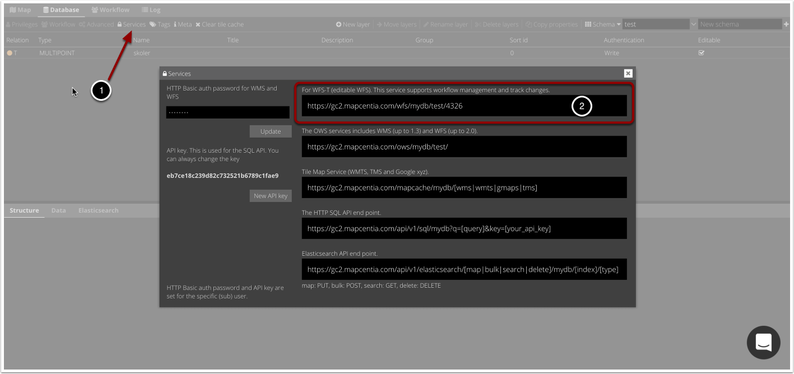
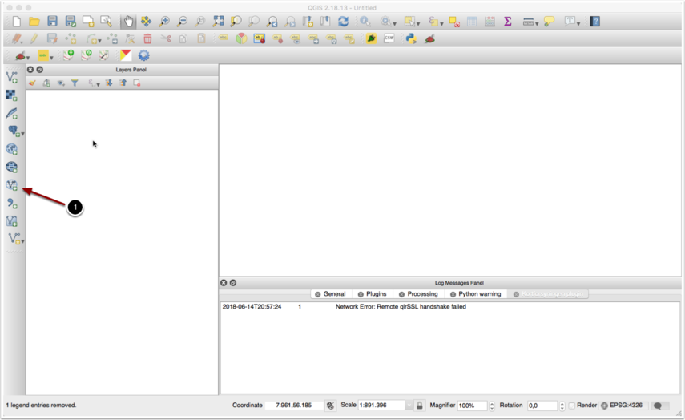
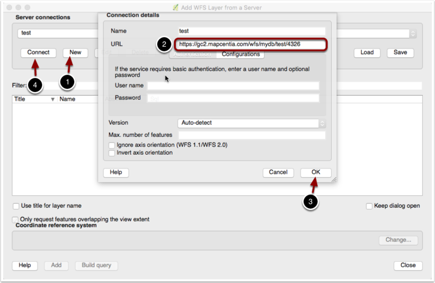
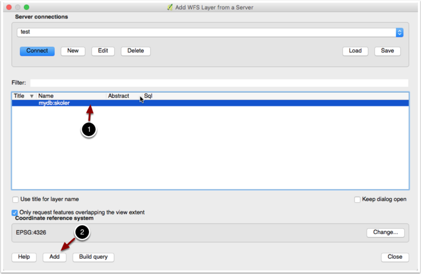
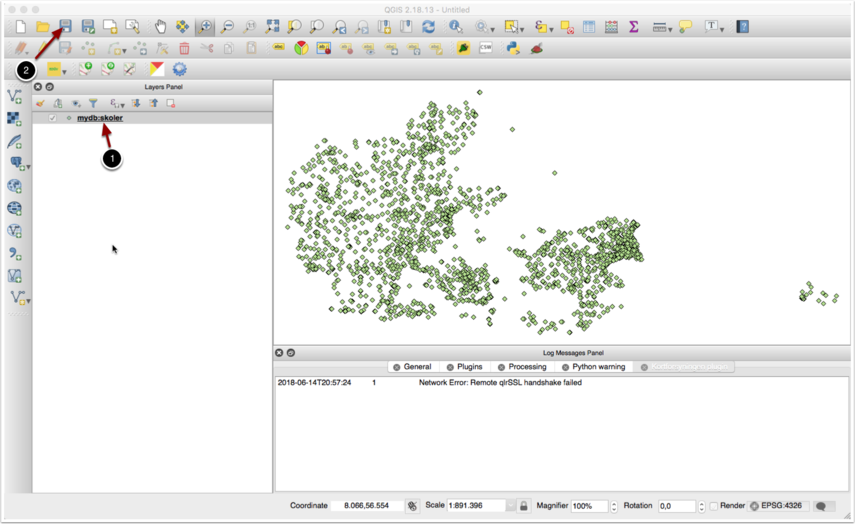
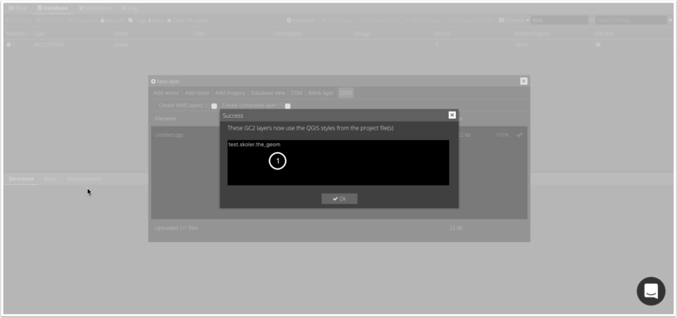
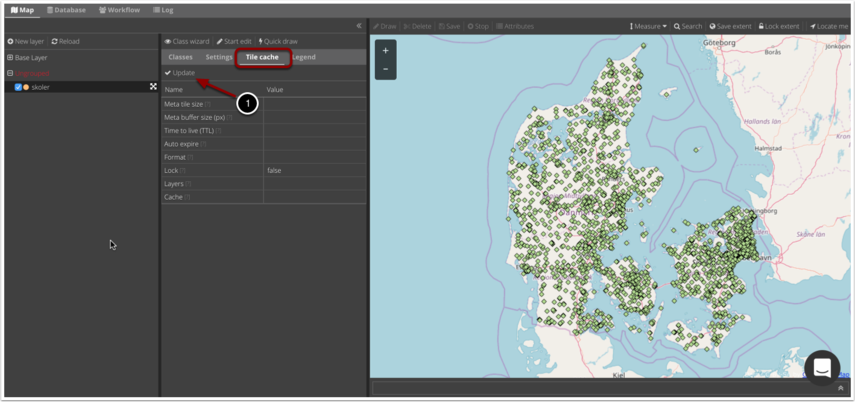

.. _qgis:

#################################################################
QGIS
#################################################################

`QGIS <https://www.qgis.org/>` desktop-programmet er et populært open source alternativ til bl.a. MapInfo og ArcMap. Flere og flere organisationer, heriblandt kommuner, er begyndt at anvende QGIS som et supplement til de kommercielle GIS produkter – nogle har endda taget skridtet fuldt ud og helt erstattet deres kommercielle desktop GIS med QGIS.

GC2 har ”QGIS Server” indbygget. Denne serversoftware gør det muligt at udstille det du ser i dit desktop QGIS som en Web Map Service (WMS). Kort fortalt er QGIS MapServer en modificeret UMN MapServer, hvor grafikmotoren er skiftet ud med den, som sidder i desktop QGIS. Da GC2 allerede anvender MapServer som grafisk back-end, passer QGIS MapServer fint ind som et supplement.

Inkluderingen af QGIS Server i GC2 indfrier et længerevarende ønske blandt GIS brugere om, at kun skulle lave kortopsætning i ét GIS produkt – i modsætning til at gøre det på både desktop og web, hvor stylingen aldrig bliver helt ens.

.. topic:: Overview

    :Date: |today|
    :GC2-version: 2020.12.0
    :Forfatter: `mapcentia <https://github.com/mapcentia>`_, `giovanniborella <https://github.com/giovanniborella>`_, `GEOsmeden <https://github.com/geosmeden>`_

.. contents:: 
    :depth: 3

.. include:: ../../_subs/NOTE_GETTINGSTARTED.rst

.. note::
    Hvis lagene bliver tematiseret gennem QGIS-projekt skal man være opmærksom på at hele projektet skal læses af MapServer inden der kan returneres et svar til klienten. Det betyder at man kan hente et væsentligt performance-boost ved at tematisere sine lag igennem MapServer.

    Hvis man angiver sin tematisering igennem QGIS første gang, vil ændringer i :ref:`styling_manual` overskrive projektet.
	
.. include:: ../../_subs/WARNING_OLD_DOC.rst

*****************************************************************
Styling med QGIS
*****************************************************************

QGIS skal hente data ud af GC2 for at kunne style dem, så først skal der forbindes til dín GC2 med WFS.

    Tjenester dialogboks

1. I Database-fanen klik på Services knappen.
#. Kopier strengen fra det øverste felt (WFS-T)

Så skal du over i QGIS

    QGIS

Bemærk, at din QGIS opsætning kan se anderledes ud end på billederne.

1. Etablere en ny WFS forbindelse.

    QGIS wfs dialogboks

1. I WFS dialogen klik på New.
#. I URL, indsæt strengen fra GC2 og i Name skrives et sigende navn.
#. Klik OK.
#. Klik Connect.

    QGIS wfs connection dialogboks
	
1. Vælge hvilke lag du vil hente ind og opsætte.
#. Klik Add.

    QGIS opsæt styling

1. Opsæt laget med den ønskede styling.
#. Gem projektet.

.. figure:: ../../../_media/qgisstyling-gc2-upload-project
    :width: 600px
    :align: center
    :name: qgisstyling-gc2-upload-project
    :figclass: align-center

    GC2 upload project
	
1. Tilbage i GC2 Admin klikkes på New layer.
#. I upload dialogen vælges QGIS.
#. Klik Add Files og vælg din QGIS projektfil (her Untitled.qgs)
#. Klik start upload.
	

    GC2 upload kvittering
	
1. Efterfølgende vises hvilke lag, som har "modtaget" QGIS styling.

    GC2 tilecache update
	
Nu bruges QGIS Server grafisk back-end og styling fra QGIS kan ses.

1. Bemærk, at det kan være nødvendig at klikke på Update i Tile cache fanen 	
	

QGIS
=================================================================

TODO: grab 07-QGIS, ref back to layer