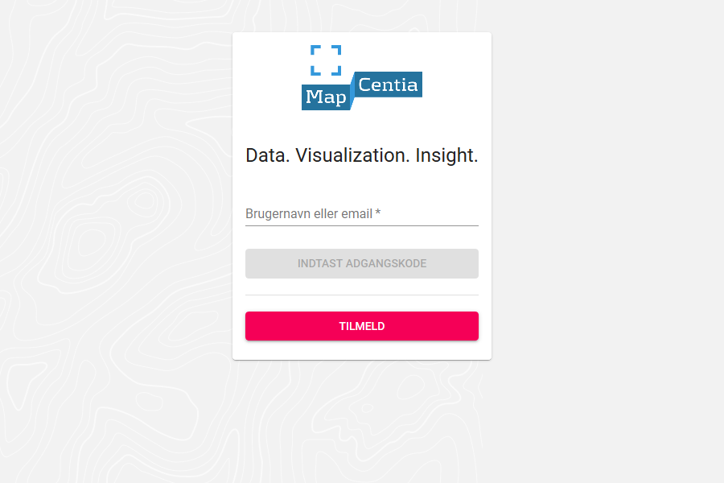
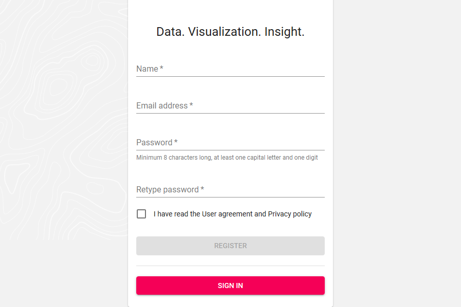
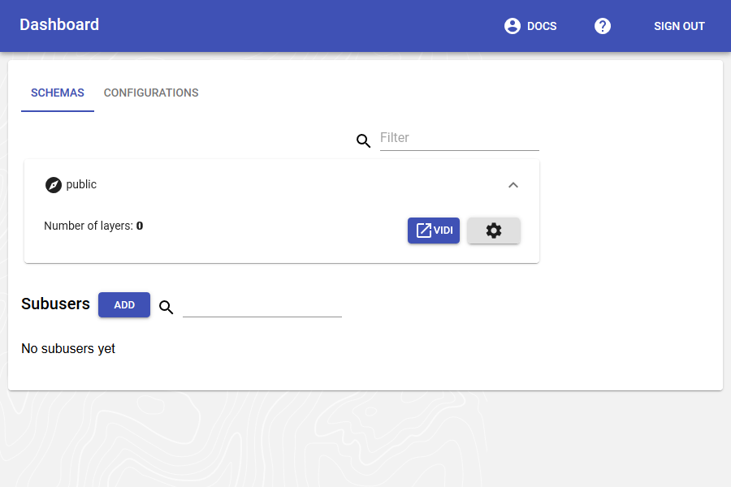
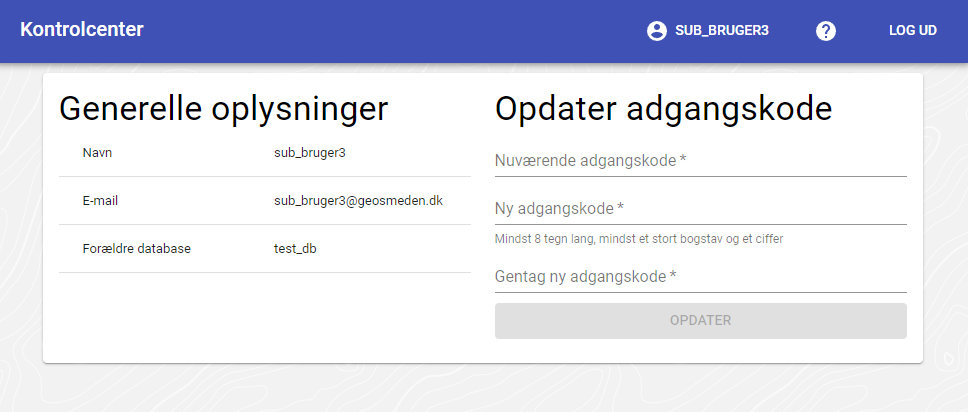

.. _gettingstarted:

============================================================
Dokumentation for GC2
============================================================

Her finder du dokumentation for GeoCloud2

I dette dokument er dokumenteret hvordan GC2 bruges, og de forskellige komponenter virker. Der findes på samme måde en dokumentation til Vidi, som er en viewer løsning til brug for visning af data fra GC2, `Vidi dokumentation finder du her. <https://vidi.readthedocs.io/>`_

API dokumentation for GC2 laves i swagger. Det betyder at dokumentationen er tilgænglig i det site der skal arbejdes på. For at finde dokumentationen, skal der navigeres til en url på sitet, som har dette format <GC2 site url>/swagger-ui/

Det er vigtigt at der bruges den apidokumnetation, som ligger på det aktuelle site, for den vil passe til den version af GC2, som der programmeres mod. `Her kan du se et ekesempel på hvordan dokumentationen ser ud. <https://dk.gc2.io/swagger-ui/>`_

*****************************************************************
Kom godt i gang med GC2
*****************************************************************

.. topic:: Overview

    :Date: |today|
    :GC2-version: 2020.12.0
    :Forfatter: `giovanniborella <https://github.com/giovanniborella>`_, `GEOsmeden <https://github.com/geosmeden>`_

.. contents:: 
    :depth: 3

Hvad er GC2?
================================================================= 

GeoCloud2 eller fremover GC2 er en enterprise platform for håndtering af geospatial data, kort-visualisering og spatiale værktøjer. Bygget på de bedste opensource og standard baserede programmer.

GC2 gør det nemt at starte med PostGIS, MapServer, QGIS Server, MapCache, Elasticsearch, GDAL/OGR2OGR. Brugerfladen i GC2, er et simpelt web-interface til administration af hele software-pakken.

Målet med GC2 er at gøre det nemt for organisationer at bruge opensource værktøjer til at bygge en geospatial infrastruktur.

For at læse mere kan du gå til :ref:`readme`

Kom i gang
=================================================================

TBD

.. _gettingstarted_login:

Log ind
-----------------------------------------------------------------

Url'en til GC2 vælges når GC2 installeres. Når man forbinder til GC2 bliver man mødt med log-in skærmen som det første. Her er det muligt at logge ind som database-bruger eller sub-bruger.

Først taster man brugernavn, derefter på ``Log ind``. Der bliver lavet et hurtigt tjek på om brugeren eksiterer. Hvis den gør, bliver det muligt at udfylde password. afslut med ``Log ind``.

Det er muligt at bruge enten brugernavn eller email.

Hvis det lykkedes at logge ind bliver man automatisk bragt videre til :ref:`dashboard`

    Log ind

.. _gettingstarted_register:

Tilmeld/opret databasebruger
-----------------------------------------------------------------

.. note::
  Hvis du leder efter subusers, kan du læse mere her: :ref:`subuser`

En databasebruger er ejeren af den database som data kommer til at leve i. Det er denne bruger der typisk bliver brugt til at administrere løsningen.

For at oprette en database-bruger trykker man ``Tilmeld``. Følg herefter registrerings-formularen for at oprette en database-bruger.

Når man er færdig, kan man bruge oplysningerne til at logge ind.

    Opret databasebruger

.. _gettingstarted_dashboard:

Kontrolcenter/Dashboard
=================================================================

Når der er logget ind i GC2, så vises kontrolcenter/dashboardet. 

Kontrolcenter er stedet hvor man i venstre side kan se en oversigt over skemaer eller konfigurationer i databasen. I højre side vises en oversigt over Sub-brugere. Der kan også tilføjes Sub-brugere.

I den blå topbar er der et spørgsmålstegn, som giver adgang til dokumentationen, og der kan åbnes en brugerprofil for den bruger der logget ind ved at klikke på brugernavnet. Se mere om brugerprofil her: :ref:`gettingstarted_userprofile`

    Kontrolcenter

Skemaer
-----------------------------------------------------------------

Hvert skema under databasebrugeren bliver vist. Der er et filter-felt, som kan bruges til at filtrere i listen.

Skemaet ``public`` bliver som standard oprettet sammen med databasebrugeren, og bør nomalt ikke bruges til noget.

Hvis der klikkes på et skema foldes det ud, og det er muligt at gøre følgende:

* Åbne Vidi med lagene der er opsat i skemaet.
* Gå til administrationsmodulet

Konfigurationer
-----------------------------------------------------------------

Konfigurationer er json filer, som gemmes i databasen. Konfigurationerne bruges til at styre opsætningen af Vidi. Dvs, det kan styres hvilke lag der vises, hvilke extensions og hvilke baggrundskort der er tilgængelige. 

Konfigurationerne oprettes her, og skal have et navn, der kan suppleres med en beskrivelse.

For en grundig gennemgang af mulighederne i konfigurationerne, så læs afsnittet i Vidi dokumentationen `Vidi kørselskonfiguration <https://vidi.readthedocs.io/da/latest/pages/standard/91_run_configuration.html>`_

.. _gettingstarted_userprofile:

Brugerprofil
-----------------------------------------------------------------

Når der er logget ind i GC2, kan man tilgå sin brugerprofil i den blå topbar. Der klikkes på brugernavnet, og der åbnes en dialogboks, hvor der kan ses brugeroplysninger og skiftes password.

    Brugerprofil

Subusers
-----------------------------------------------------------------

Her vises alle subusers. For at få mere information om subusers, kan du læse :ref:`subuser`

.. _gettingstarted_admin:

Administrationsmodul
=================================================================

Administrationsmodulet er delt op i faner. Fanerne er nærmere beskrevet herunder.

.. _gettingstarted_admin_map:

Kort
-----------------------------------------------------------------

I fanen "Kort" kan man i venstre side se en oversigt over de lag der er i skemaet. Hvis lagene ikke er sat op endnu, findes de under ungrouped. Ellers findes de i den gruppering der er lavet i database fanen, som beskrives senere. Over laglisten er der mulighed for at tilføje nye lag, og reloade siden, hvis der er lavet noget der ikke vises rigtigt.

Til højre for lagoversigten findes styling vinduet. Her kan der for hvert lag laves en opsætning af kartografien på laget. Der er en class wizard, som kan bruges til at lave en hurtig opsætning, som så efterfølgende kan justeres.

I resten af fanen vises et kort, hvor de opsatte data kan se, når laget tændes i lag træet.

.. _gettingstarted_admin_database:

.. figure:: ../../../_media/gettingstarted-admin-map.png
    :width: 690px
    :align: center
    :name: gettingstarted-admin-map
    :figclass: align-center

    Map

Database
-----------------------------------------------------------------

I Databasefanen kan databasen administreres. Det er her de overordnede egenskaber på lag sættes og tabelstrukturen kan ændres.

.. figure:: ../../../_media/gettingstarted-admin-database.png
    :width: 690px
    :align: center
    :name: gettingstarted-admin-database
    :figclass: align-center

    Database

Laglisten
~~~~~~~~~~~~~~~~~~~~~~~~~~~~~~~~~~~~~~~~~~~~~~~~~~~~~~~~~~~~~~~~~~

Øverste del af fanen er rummer en linje med forskllige funktioner. Under linjen findes laglisten.

.. figure:: ../../../_media/gettingstarted-admin-database-layerlist.png
    :width: 690px
    :align: center
    :name: gettingstarted-database-layerlist
    :figclass: align-center

    Lagliste

Lags egenskaber kan ændres ved at dobbeltklikke på det felt i listen, som ønskes ændret.  

1. Type: Lagets geometritype som kan være (MULTI)POINT, (MULTI)LINESTRING, (MULTI)POLYGON eller GEOMETRY. Sidste betyder, at laget kan have en blandning af flere forskellige typer. Lagets type kan ikke ændres.
#. Navn: Det tekniske navn på laget. Hvis laget er importeret fra en fil svarer navnet på laget til filnavnet. Lagets tekniske navn kan ikke ændres.
#. Titel: Lagets titel. Hvis titel er sat, er det den, som vises i lagtræ, signaturer, WMS/WFS titler mv.
#. Beskrivelse: En beskrivende tekst til laget. Bruges i WMS/WFS abstract.
#. Gruppe: Grupper anvendes til at inddele lagtræet i Map fanen og i Vieweren. Dette er combo felt: Enten skrives navnet på en ny gruppe eller der vælges en allerede eksisterende.
#. Sort id: Placering af laget i laghierarki. Dvs. om et lag ligger ovenpå eller underneden et andet lag, når de vises sammen i Map fanen eller Vieweren.
#. Authentication: Hvilket niveau af authentication ønskes for det enkelte lag i WMS og WFS tjenester? Write = authentication kun ved editering, Read/Write = authentication ved både læsning og editering, None = ingen authentication på laget.
#. Skrivebar: Hvis slået fra, kan laget ikke editeres i Map fanen eller gennem WFS-T.
#. Tile cache: Manuelt sletning af lagets tile cache. Dette er normalt ikke nødvendigt at gøre, da GC2 søger for sletning, når der er brug for det.

Tabelstruktur
~~~~~~~~~~~~~~~~~~~~~~~~~~~~~~~~~~~~~~~~~~~~~~~~~~~~~~~~~~~~~~~~~~

Når et lag i laglisten vælges, vises lagets tabelstruktur i sektion nedenunder. Her kan sættes egenskaber på kolonnerne. Egenskaber kan ændres ved at dobbeltklikke på det felt i listen, som ønskes ændret. Kolonner kan tilføjes og slettes.

.. figure:: ../../../_media/gettingstarted-admin-database-table-structure.png
    :width: 690px
    :align: center
    :name: gettingstarted-database-layerlist
    :figclass: align-center

    Tabelstruktur

1. Sort id: I hvilken rækkefølge kan kolonnerne vises i ved forespørgelser i Vieweren. Kolonner med lavere Sort id vises øverest.
#. Kolonne: Navn på kolonnen. Navnet kan ændres, men overvej at benytte Alias (4) i stedet for.
#. Type: Kolonnens type. Kan ikke ændres.
#. ALLOW NULL:
#. Alias: Et alias til kolonnen. Vises ved forespørgelser i Vieweren.
#. Vis i klik-info: Skal kolonnen vises ved forespørgelser i Vieweren? Udgangspunktet er, at alle kolonner vises. Ændres der ved disse egenskaber, vises kun dem, som er tjekket af.
#. VIS I MOUSE-OVER:
#. SØGBAR:
#. AKTIVER FILTRERING:
#. Gør til link: Hvis indholdet i kolonnen er et link, kan det gøres aktivt i Vieweren ved forespørgelser.
#. IMAGE:
#. Link prefix: Hvis links fx mangler "http://" kan dette tilføjes her.
#. EGENSKABER:
#. Properties: Kan indeholde vilkårligt information til bruges i brugertilpassede applikationer.
#. Tilføj ny kolonne: Tilføj en ny kolonne til lagets tabel.
#. Slet kolonne: Slet den valgte kolonne.

Flyt lag mellem schemaer
~~~~~~~~~~~~~~~~~~~~~~~~~~~~~~~~~~~~~~~~~~~~~~~~~~~~~~~~~~~~~~~~~~

.. figure:: ../../../_media/gettingstarted-admin-database-movelayer-schema.png
    :width: 690px
    :align: center
    :name: gettingstarted-database-layerlist
    :figclass: align-center

    Flyt lag mellem schemaer

1. Vælg et eller flere lag på laglisten (hold Shift eller Ctrl nede for at vælge flere) og klik "Flyt lag".
#. Vælg hvilket schema de skal flyttes til.

Omdøb lag
~~~~~~~~~~~~~~~~~~~~~~~~~~~~~~~~~~~~~~~~~~~~~~~~~~~~~~~~~~~~~~~~~~

.. figure:: ../../../_media/gettingstarted-admin-database-rename-layer.png
    :width: 690px
    :align: center
    :name: gettingstarted-database-layerlist
    :figclass: align-center

    Omdøb lag
	
1. Vælg et enkelt lag og klik "Omdøb layer".
#. Vælg et nyt navn til laget.

Skab tabel fra bunden
~~~~~~~~~~~~~~~~~~~~~~~~~~~~~~~~~~~~~~~~~~~~~~~~~~~~~~~~~~~~~~~~~~

Du kan skabe en ny tom tabel fra bunden ved først at klikke på nyt lag

.. figure:: ../../../_media/gettingstarted-admin-database-create-table.png
    :width: 690px
    :align: center
    :name: gettingstarted-database-layerlist
    :figclass: align-center

    Klik nyt lag
	
	
.. figure:: ../../../_media/gettingstarted-admin-database-create-table-dialog.png
    :width: 690px
    :align: center
    :name: gettingstarted-database-layerlist
    :figclass: align-center

    Nyt lag dialogboks
	
1. Klik på Blank layer.
#. giv den nye tabel et navn.
#. Sæt EPSG kode for geometri-feltet.
#. Sæt type kode for geometri-feltet.

Hvis du vil have en tabel uden geometri, så slettes geometri-feltet bare efter tabellen er oprettet.

.. _gettingstarted_admin_versioning:

Versionering af data (Track changes)
-----------------------------------------------------------------

Ved versionering af data beholdes alle ændringer i tabellen. Dvs. at den fulde transaktions-historik beholdes. Versionering gør brugerne i stand til at gå tilbage i historien og se hvordan et lag så ud på et bestemt tidspunkt. Versionering virker også som journalisering af alle transaktioner foretaget på laget.

Et versioneret lag fungerer ligesom alle andre lag og kan redigeres på normal vis. GC2 tager sig af versioneringen i baggrunden.

Versionering foregår i WFS laget. Dvs. at det fungerer både ved redigering i GC2's Map fane, men også igennem eksterne WFS editors som f.eks. QGIS.

.. include:: ../../_subs/WARNING_OLD_DOC.rst

**Start "Tracking changes" på et lag**

.. figure:: ../../../_media/versioning-start-tracking-changes.png
    :width: 600px
    :align: center
    :name: versioning-start-tracking-changes
    :figclass: align-center

    start versioning

1. Vælg lag ved at klikke på linjen så den bliver grå.
#. Klik på "Start versionering".

**Nye system-felter i tabellen**

.. figure:: ../../../_media/versioning-system-fields.png
    :width: 600px
    :align: center
    :name: versioning-system-fields
    :figclass: align-center

    Nye felter

Lagets tabel får fem nye system-felter (system-felter starter altid med "gc2_"). Felter indeholder versionsdata for hver enkelt feature i tabellen. System-felterne er:

**gc2_versions_gid** Er en nøgle, som relaterer en features forskellige versioner. Dvs. er to versioner af denne samme feature, har samme nøgleværdi.

**gc2_version_start_date** Er et tidsstempel, som angiver hvornår versionen er oprettet. Alle features har en værdi i dette felt.

**gc2_version_end_date** Er et tidsstempel, som angiver hvornår versionen er afsluttet. Kun afsluttede versioner har en værdi i dette felt og den aktuelle version har ikke værdi i dette felt.

**gc2_version_uuid** Er en "universally unique identifier" som alle versioner får tildelt. Denne værdi er global unik.

**gc2_version_user** Er den (sub-)bruger, der har skabt versionen.

**Versionsdata i tabellen**

.. figure:: ../../../_media/versioning-versiondata.png
    :width: 600px
    :align: center
    :name: versioning-versiondata
    :figclass: align-center

    versionsdata

Dette er et eksempel på versionsdata i tabellen. Denne versionerede tabel har tre nye punkter, som hver har dato/tid for oprettelsen (gc2_version_start_date), et unikt id (gc2_version_uuid) samt hvilken bruger, der har oprettet punkterne (gc2_version_user).

**Se alle versioner**

.. figure:: ../../../_media/versioning-see-all-versions.png
    :width: 600px
    :align: center
    :name: versioning-see-all-versions
    :figclass: align-center

    versionsdata

Som standard vises kun aktuelle features, dvs. dem uden en gc2_version_end_date. Det er muligt at se alle features på en gang.

1. Start redigering af laget.
#. Vælg "all" under "Time slicing", som skal tjekkes af i boksen.
#. Load features.

.. figure:: ../../../_media/versioning-example.png
    :width: 600px
    :align: center
    :name: versioning-example
    :figclass: align-center

    Eksempel på versioner
	
Eksemplet viser to aktuelle punkter. Endvidere ses det, at punktet med **gc2_version_gid** = 2 findes i to versioner: En aktuel og en afsluttet. Dvs. at punktet har været redigeret. Punktet med **gc2_version_gid** = 1 er afsluttet og der er ikke andre versioner af dette punkt. Dvs. at punktet er slettet.

Afsluttede versioner vise med rød, stiplet kant. Disse kan ikke redgieres.

**Time slicing**
	
.. figure:: ../../../_media/versioning-timeslicing.png
    :width: 600px
    :align: center
    :name: versioning-timeslicing
    :figclass: align-center

    Timeslicing
	
Det er muligt at se hvordan et lag så ud på et bestemt tidspunkt.

1. Start redigering af laget.
#. Tjek "Time slicing" af og skriv en dato/tid i formatet yyyy-mm-dd hh:mm:ss fx 2015-06-30 14:34:00. Undlades tiden vil den blive sat til 00:00:00.
#. Load features.
	
	
.. figure:: ../../../_media/versioning-timeslicing-example.png
    :width: 600px
    :align: center
    :name: versioning-timeslicing-example
    :figclass: align-center

    Timeslicing eksempel
	
Ved Time slicing vises de versioner, som var aktuelle på den pågældende dato/tid. Dvs. at der kun vises én version pr. feature (**gc2_version_gid** værdierne er unikke). Eksemplet viser, at der var tre aktuelle punkter, hvoraf et stadig er aktuelt (det blå) og to, som senere enten er ændret eller slettet (røde). For de ændrede punkter viser **gc2_version_end_date** tidspunktet for ændringen.
	
	**Versionering i ekstern editor fx QGIS**
	
	
.. figure:: ../../../_media/versioning-example-qgis.png
    :width: 600px
    :align: center
    :name: versioning-example-qgis
    :figclass: align-center

    versionering i QGIS

Versionering foregår i WFS laget. Dvs. at det fungerer både ved redigering i GC2's Map fane, men også igennem eksterne WFS editors som f.eks. QGIS.

Ved brug af standard WFS forbindelsesstrengen vises kun de aktuelle versioner. Dvs. at dette er ikke andersledes end for ikke-versionerede lag:

http://example.com/wfs/mydb/public/4326

Hvis alle versioner skal vises i QGIS bruges denne streng:

http://example.com/wfs/mydb/public/4326/all

Og ved Time slicing bruges denne: (Bemærk "T" mellem dato og tid)

http://example.com/wfs/mydb/public/4326/2015-06-30T14:34:00

.. _gettingstarted_admin_workflow:

Workflow management
-----------------------------------------------------------------

Workflow giver mulighed for at kontrollere redigeringen af et lag i en typisk forfatter-redaktør-udgiver kæde.

Et lag under workflow kontrol fungerer ligesom alle andre lag og kan redigeres på normal vis. GC2 tager sig af workflowet i baggrunden.

Workflow foregår i WFS laget. Dvs. at det fungerer både ved redigering i GC2's Map fane, men også igennem eksterne WFS editors som f.eks. QGIS.

**Start "track changes" på laget.**

.. figure:: ../../../_media/workflow-start-tracking-changes.png
    :width: 600px
    :align: center
    :name: workflow-start-tracking-changes
    :figclass: align-center

    start versioning
	
Workflow bygger oven på versionerings-systemet i GC2, så det er nødvendigt at starte "Track changes" på laget.

1. Vælg et lag ved at klikke på linjen så den bliver grå.
#. Klik på "Track changes". Læs mere om "Track changes"
#. VIGTIGT! Husk at sætte Authentication niveauet til "Read/write" på laget.	
	
**Tildel privilegier til sub-brugere**
	
.. figure:: ../../../_media/workflow-add-privileges.png
    :width: 600px
    :align: center
    :name: workflow-add-privileges
    :figclass: align-center

    Workflow
	
De sub-brugere, som skal have en rolle i workflowet, skal have tildelt privilegier til laget. Læs mere om sub-brugere og privilegier.

1. Vælg et lag ved at klikke på linjen så den bliver grå.
#. Klik på "Privilegier".
#. Sæt privilegiet til "Læse og skrive" (eller "Alle") for hver sub-bruger, der skal have en rolle i workflowet.
	
**Start Workflow på laget**
	
.. figure:: ../../../_media/workflow-start-workflow.png
    :width: 600px
    :align: center
    :name: workflow-start-workflow
    :figclass: align-center

    Start Workflow
	
1. Start workflow på laget ved at klikke på "Workflow".
#. Workflow dialogen vises.
#. Lagets tabel får to nye system-felter (system-felter starter altid med "gc2_"). Felterne indeholder workflow-data for hver enkelt feature i tabellen. Felterne er:

``gc2_status`` Indeholder featurens status, som er enten: 1 = Draft, 2 = Reviewed eller 3 = Published.

``gc2_workflow`` Indeholder workflow-kæden.

**Tildel roller i Workflowet**
	
.. figure:: ../../../_media/workflow-add-roles.png
    :width: 600px
    :align: center
    :name: workflow-add-roles
    :figclass: align-center

    Workflow roller
	
En sub-bruger kan have en af følgende roller i et workflow:

**Author** Kan oprette nye features. Kan også ændre en feature, som IKKE er Reviewed eller Published. Dvs. som ikke er kommet videre i workflowet.

**Reviewer** Kan ændre eller godkende en feature. Kan IKKE ændre en feature, som er Published.

**Publisher** Kan ændre eller godkende en feature til endelig udgivelse.

Sub-brugere, som ikke har en rolle i workflowet, kan ikke lave ændringer i laget.

En rolle kan varetages af to eller flere brugere. Fx kan et lag have to Authors.

Bemærk, at det ikke er nødvendigt, at alle roller er besatte. Fx hvis man ønsker at springe Reviewer ledet over, kan dette gøres.
	
	
**Workflow fanen**
	
.. figure:: ../../../_media/workflow-workflow-tab.png
    :width: 600px
    :align: center
    :name: workflow-workflow-tab
    :figclass: align-center

    Workflow fanen
	
Når et lag er under workflow-kontrol kan alle transaktioner på laget ses i fanen "Workflow". Hver linje er en transaktion. Listen viser kun transaktioner, som er relavante for brugeren, dvs. dem som brugeren skal tage action på.

Eksemplet viser en transaktion på et punkt foretaget af Lilly, som er Author.

Hver transaktion har følgende værdier:

**Operation** Er hvilken operation, der er foretaget på laget: insert, update eller delete.

**Table** Hvilken tabel transaktionen udført på.

**Fid**  Primærnøglens værdi på den feature transaktionen er udført på.

**Version id** Versions-id'ets værdi på den feature transaktionen er udført på.

**Status** Den status featuren har efter transaktionen.

**Latest edit by** Den sub-bruger, som har udført transaktionen.

**Authored by** Den Author, der har oprettet featuren.

**Reviewed by** Den Reviewer, som har godkendt featuren.

**Published by** Den Publisher, som har godkendt featuren.

**Created** Transaktionen tidsstempel.

Knapper i Workflow

1. **Show all**. Viser alle transaktioner. Også den, som ikke er aktuelle for brugeren.
#. **See/edit feature**. Skifter til Map fanen og loader featuren.
#. **Check feature**. Godkender featuren. Svarer til en update af featuren uden at ændre den.
	
	
**Efter "Review"**
	
.. figure:: ../../../_media/workflow-after-review.png
    :width: 600px
    :align: center
    :name: workflow-after-review
    :figclass: align-center

    Workflow status
	
Eksemplet viser et punkt, som er reviewed (godkendt af Reviewer Carl). Punktet har nu status 2.

**Efter "Publish"**
	
.. figure:: ../../../_media/workflow-after-publish.png
    :width: 600px
    :align: center
    :name: workflow-after-publish
    :figclass: align-center

    Workflow status published
	
Eksemplet viser et punkt, som er published (godkendt af Publisher Julie). Punktet har nu status 3.
	
**Overspring i Workflow kæden**
	
.. figure:: ../../../_media/workflow-skip-step.png
    :width: 600px
    :align: center
    :name: workflow-skip-step
    :figclass: align-center

    Workflow overspring
	
Det er muligt for en bruger at springe et lavere led i workflow-kæden over. Eksemplet viser, at reviewer Carl er sprunget over af publisher Julie.
	
**Workflow information i data**
	
.. figure:: ../../../_media/workflow-display-data.png
    :width: 600px
    :align: center
    :name: workflow-display-data
    :figclass: align-center

    Workflow visning i data
	
Workflow informationerne til de enkelte features bliver gemt i lagets tabel i felterne **gc2_status** og **gc2_workflow**.

**gc2_status** Angiver status 1-3.

**gc2_workflow** Indeholder workflow-kæden. Kæden er en liste i formen fx: "author"=>"lilly", "reviewer"=>"carl" Denne kæde viser, at punktet er oprettet af Lilly, reviewed af Carl, men stadig ikke godkendt af en publisher.
	
**Brug af ekstern editor i Workflow**
	
.. figure:: ../../../_media/workflow-in-qgis.png
    :width: 600px
    :align: center
    :name: workflow-in-qgis
    :figclass: align-center

    Workflow i QGIS
	
Workflow foregår i WFS laget. Dvs. at det fungerer både ved redigering i GC2's Map fane, men også igennem eksterne WFS editors som f.eks. QGIS.

Laget hentes ind og redigeres på sædvanlig vis i QGIS.
	
	
	
	
	
	
	
	
	

.. _gettingstarted_admin_log:

Log
-----------------------------------------------------------------

TBD

.. figure:: ../../../_media/gettingstarted-admin-log.png
    :width: 400px
    :align: center
    :name: gettingstarted-admin-log
    :figclass: align-center

    Log