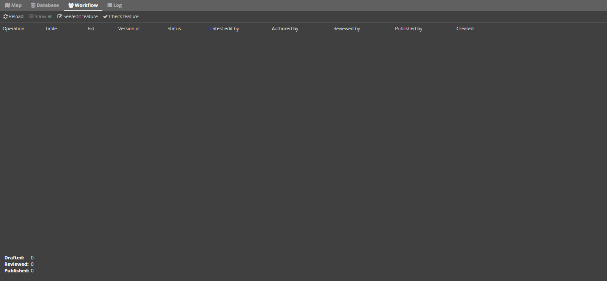

.. _gettingstarted:

*****************************************************************
Kom godt i gang med GC2
*****************************************************************

.. topic:: Overview

    :Date: |today|
    :GC2-version: 2020.12.0
    :Forfatter: `giovanniborella <https://github.com/giovanniborella>`_

.. contents:: 
    :depth: 3

Hvad er GC2?
================================================================= 

GC2 er en enterprise platform for håndtering af geospatial data, kort-visualisering og spatiale værktøjer. Bygget på de bedste opensource og standard baserede programmer.

GC2 gør det nemt at starte med PostGIS, MapServer, QGIS Server, MapCache, Elasticsearch, GDAL/OGR2OGR samt en simpel web-interface til administration af hele software-pakken.

Målet med GC2 er at gøre det nemt for organisationer at bruge opensource værktøjer til at bygge en geospatial infrastruktur.

For at læse mere kan du gå til :ref:`readme`

Kom i gang
=================================================================

TBD

.. _gettingstarted_login:

Log ind
-----------------------------------------------------------------

Når man forbinder til GC2 bliver man mødt med log-in skærmen som det første. Her er det muligt at logge ind som database-bruger eller sub-bruger.

Først taster man brugernavn, derefter på ``Log ind``. Der bliver lavet et hurtigt tjek på om brugeren eksiterer. Hvis den gør, bliver det muligt at udfylde password. afslut med ``Log ind``.

Det er muligt at bruge enten brugernavn eller email.

Hvis det lykkedes at logge ind bliver man automatisk bragt videre til :ref:`dashboard`

.. figure:: ../../../_media/gettingstarted-login.png
    :width: 400px
    :align: center
    :name: gettingstarted-login
    :figclass: align-center

    Log ind

.. _gettingstarted_register:

Opret user
-----------------------------------------------------------------

.. note::
  Hvis du leder efter subusers, kan du læse mere her: :ref:`subuser`

En databasebruger er ejeren af den database som data kommer til at leve i. Det er denne bruger der typisk bliver brugt til at administrere løsningen.

For at oprette en database-bruger trykker man ``Tilmeld``. Følg herefter registrerings-formularen for at oprette en database-bruger.

Når man er færdig, kan man bruge oplysningerne til at logge ind.

.. figure:: ../../../_media/gettingstarted-register.png
    :width: 400px
    :align: center
    :name: gettingstarted-register
    :figclass: align-center

    Opret bruger

.. _gettingstarted_dashboard:

Dashboard
=================================================================

TBD

.. figure:: ../../../_media/gettingstarted-dashboard.png
    :width: 400px
    :align: center
    :name: gettingstarted-dashboard
    :figclass: align-center

    Dashboard

Skemaer
-----------------------------------------------------------------

Hvert skema under databasebrugeren bliver vist. Det er også muligt at bruge filter-feltet til at Skemaet ``public`` bliver oprettet sammen med databasebrugeren.

For hvert skema er det muligt at gøre følgende:

* Gå direkte til vidi
* Gå til administrationsmodulet

Konfigurationer
-----------------------------------------------------------------

TBD

Profil
-----------------------------------------------------------------

TBD

Subusers
-----------------------------------------------------------------

Her vises alle subusers. For at få mere information om subusers, kan du læse :ref:`subuser`

.. _gettingstarted_admin:

Administrationsmodul
=================================================================

Administrationsmodulet er bygget op i faner. Disse er nærmere beskrevet på herunder.

.. _gettingstarted_admin_map:

Map
-----------------------------------------------------------------

TBD

.. _gettingstarted_admin_database:

.. figure:: ../../../_media/gettingstarted-admin-map.png
    :width: 400px
    :align: center
    :name: gettingstarted-admin-map
    :figclass: align-center

    Map

Database
-----------------------------------------------------------------

TBD

.. figure:: ../../../_media/gettingstarted-admin-database.png
    :width: 400px
    :align: center
    :name: gettingstarted-admin-database
    :figclass: align-center

    Database

.. _gettingstarted_admin_workflow:

Workflow
-----------------------------------------------------------------

TBD

    Workflow

.. _gettingstarted_admin_log:

Log
-----------------------------------------------------------------

TBD

.. figure:: ../../../_media/gettingstarted-admin-log.png
    :width: 400px
    :align: center
    :name: gettingstarted-admin-log
    :figclass: align-center

    Log