.. _gettingstarted_admin:

#################################################################
Administrationsmodul
#################################################################

.. topic:: Overview

    :Date: |today|
    :GC2-version: 2022.9.1
    :Forfatter: `mapcentia <https://github.com/mapcentia>`_, `giovanniborella <https://github.com/giovanniborella>`_, `Bo Henriksen <https://github.com/BoMarconiHenriksen>`_

.. contents::
    :depth: 5

.. include:: ../../_subs/NOTE_GETTINGSTARTED.rst

Administrationsmodulet er delt op i faner. Fanerne er nærmere beskrevet herunder.

.. _gettingstarted_admin_map:

Kort
-----------------------------------------------------------------

I fanen "Kort" kan man i venstre side se en oversigt over de lag der er i skemaet. Hvis lagene ikke er sat op endnu, findes de under ungrouped. Ellers findes de i den gruppering der er lavet i database fanen, som beskrives senere. Over laglisten er der mulighed for at tilføje nye lag, og reloade siden, hvis der er lavet noget der ikke vises rigtigt.

Til højre for lagoversigten findes styling vinduet. Her kan der for hvert lag laves en opsætning af kartografien på laget. Der er en class wizard, som kan bruges til at lave en hurtig opsætning, som så efterfølgende kan justeres.

I resten af fanen vises et kort, hvor de opsatte data kan se, når laget tændes i lag træet.

.. _gettingstarted_admin_database:

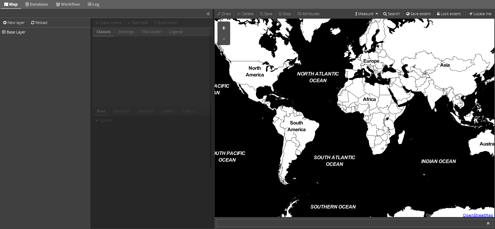

    Map

Database
-----------------------------------------------------------------

I Databasefanen kan databasen administreres. Det er her de overordnede egenskaber på lag sættes og tabelstrukturen kan ændres.

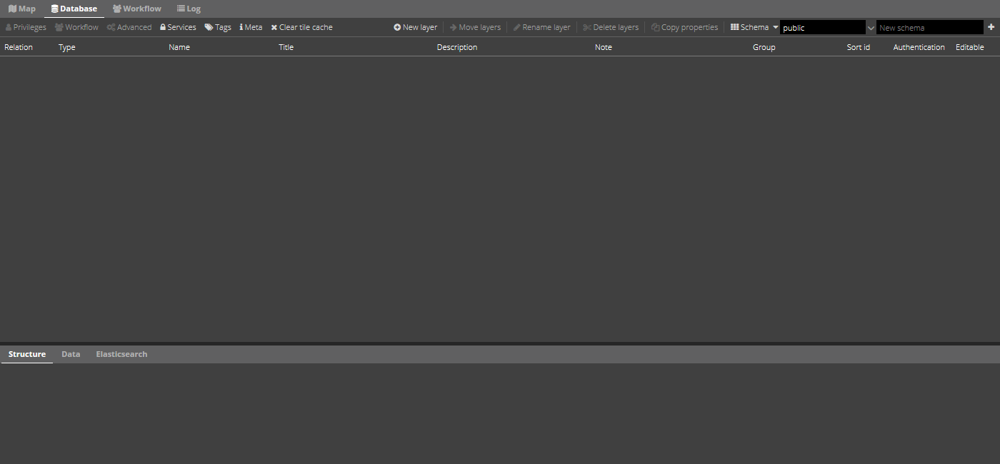

    Database

Laglisten
~~~~~~~~~~~~~~~~~~~~~~~~~~~~~~~~~~~~~~~~~~~~~~~~~~~~~~~~~~~~~~~~~~

Øverste del af fanen er rummer en linje med forskllige funktioner. Under linjen findes laglisten.

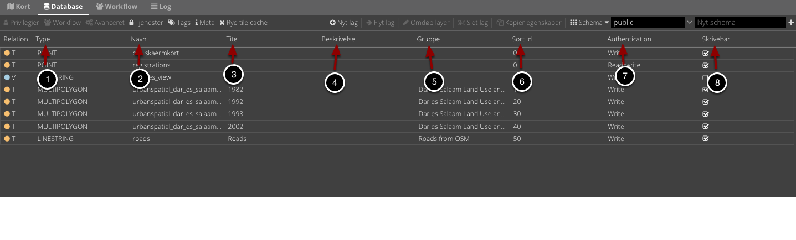

    Lagliste

Lags egenskaber kan ændres ved at dobbeltklikke på det felt i listen, som ønskes ændret.

1. Type: Lagets geometritype som kan være (MULTI)POINT, (MULTI)LINESTRING, (MULTI)POLYGON eller GEOMETRY. Sidste betyder, at laget kan have en blandning af flere forskellige typer. Lagets type kan ikke ændres.
#. Navn: Det tekniske navn på laget. Hvis laget er importeret fra en fil svarer navnet på laget til filnavnet. Lagets tekniske navn kan ikke ændres.
#. Titel: Lagets titel. Hvis titel er sat, er det den, som vises i lagtræ, signaturer, WMS/WFS titler mv.
#. Beskrivelse: En beskrivende tekst til laget. Bruges i WMS/WFS abstract.
#. Gruppe: Grupper anvendes til at inddele lagtræet i Map fanen og i Vieweren. Dette er combo felt: Enten skrives navnet på en ny gruppe eller der vælges en allerede eksisterende.
#. Sort id: Placering af laget i laghierarki. Dvs. om et lag ligger ovenpå eller underneden et andet lag, når de vises sammen i Map fanen eller Vieweren.
#. Authentication: Hvilket niveau af authentication ønskes for det enkelte lag i WMS og WFS tjenester? Write = authentication kun ved editering, Read/Write = authentication ved både læsning og editering, None = ingen authentication på laget.
#. Skrivebar: Hvis slået fra, kan laget ikke editeres i Map fanen eller gennem WFS-T.
#. Tile cache: Manuelt sletning af lagets tile cache. Dette er normalt ikke nødvendigt at gøre, da GC2 søger for sletning, når der er brug for det.

Tabelstruktur
~~~~~~~~~~~~~~~~~~~~~~~~~~~~~~~~~~~~~~~~~~~~~~~~~~~~~~~~~~~~~~~~~~

Når et lag i laglisten vælges, vises lagets tabelstruktur i sektion nedenunder. Her kan sættes egenskaber på kolonnerne. Egenskaber kan ændres ved at dobbeltklikke på det felt i listen, som ønskes ændret. Kolonner kan tilføjes og slettes.

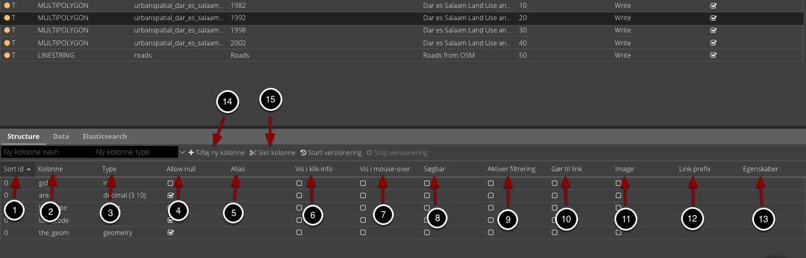

    Tabelstruktur

1. Sort id: I hvilken rækkefølge kan kolonnerne vises i ved forespørgelser i Vieweren. Kolonner med lavere Sort id vises øverest.
#. Kolonne: Navn på kolonnen. Navnet kan ændres, men overvej at benytte Alias (4) i stedet for.
#. Type: Kolonnens type. Kan ikke ændres.
#. ALLOW NULL:
#. Alias: Et alias til kolonnen. Vises ved forespørgelser i Vieweren.
#. Vis i klik-info: Skal kolonnen vises ved forespørgelser i Vieweren? Udgangspunktet er, at alle kolonner vises. Ændres der ved disse egenskaber, vises kun dem, som er tjekket af.
#. VIS I MOUSE-OVER:
#. SØGBAR:
#. AKTIVER FILTRERING:
#. Gør til link: Hvis indholdet i kolonnen er et link, kan det gøres aktivt i Vieweren ved forespørgelser.
#. IMAGE:
#. Link prefix: Hvis links fx mangler "http://" kan dette tilføjes her.
#. EGENSKABER:
#. Properties: Kan indeholde vilkårligt information til bruges i brugertilpassede applikationer.
#. Tilføj ny kolonne: Tilføj en ny kolonne til lagets tabel.
#. Slet kolonne: Slet den valgte kolonne.

Flyt lag mellem schemaer
~~~~~~~~~~~~~~~~~~~~~~~~~~~~~~~~~~~~~~~~~~~~~~~~~~~~~~~~~~~~~~~~~~

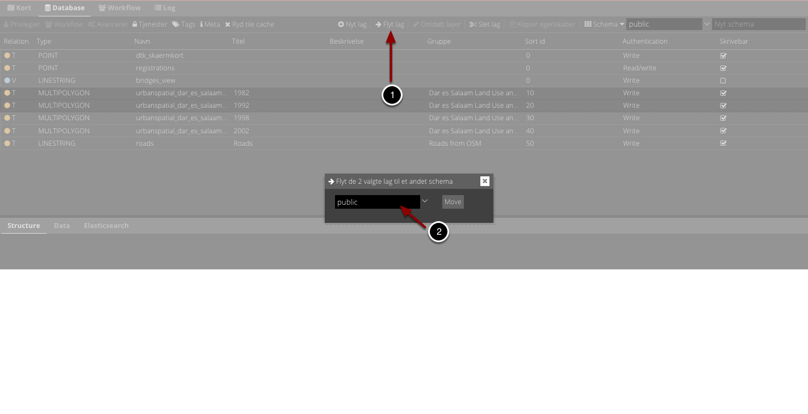

    Flyt lag mellem schemaer

1. Vælg et eller flere lag på laglisten (hold Shift eller Ctrl nede for at vælge flere) og klik "Flyt lag".
#. Vælg hvilket schema de skal flyttes til.

Omdøb lag
~~~~~~~~~~~~~~~~~~~~~~~~~~~~~~~~~~~~~~~~~~~~~~~~~~~~~~~~~~~~~~~~~~

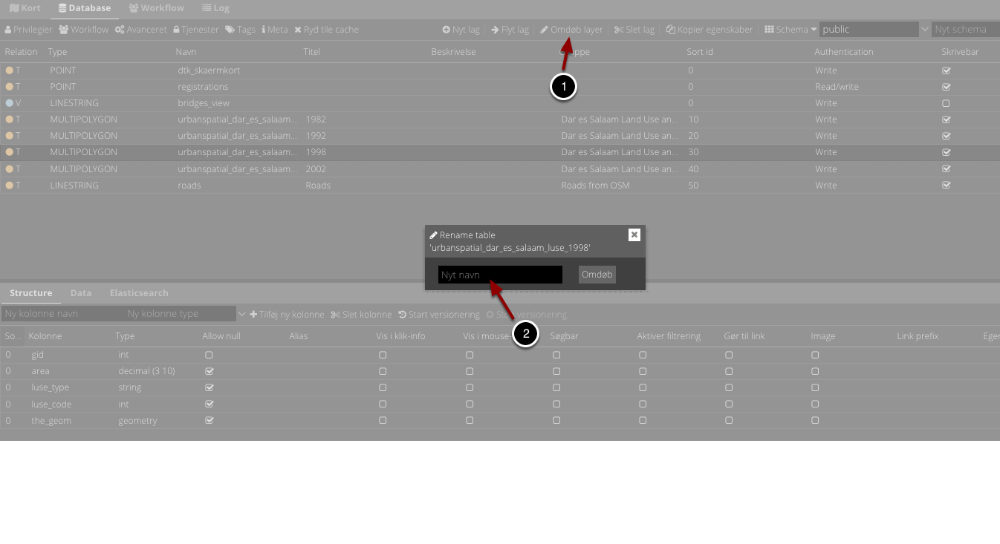

    Omdøb lag

1. Vælg et enkelt lag og klik "Omdøb layer".
#. Vælg et nyt navn til laget.

Skab tabel fra bunden
~~~~~~~~~~~~~~~~~~~~~~~~~~~~~~~~~~~~~~~~~~~~~~~~~~~~~~~~~~~~~~~~~~

Du kan skabe en ny tom tabel fra bunden ved først at klikke på nyt lag

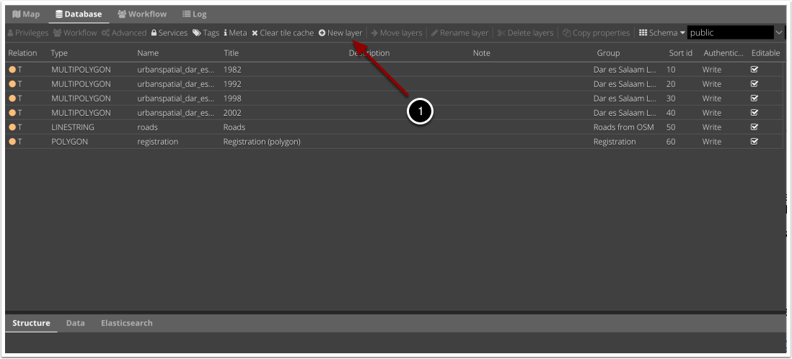

    Klik nyt lag

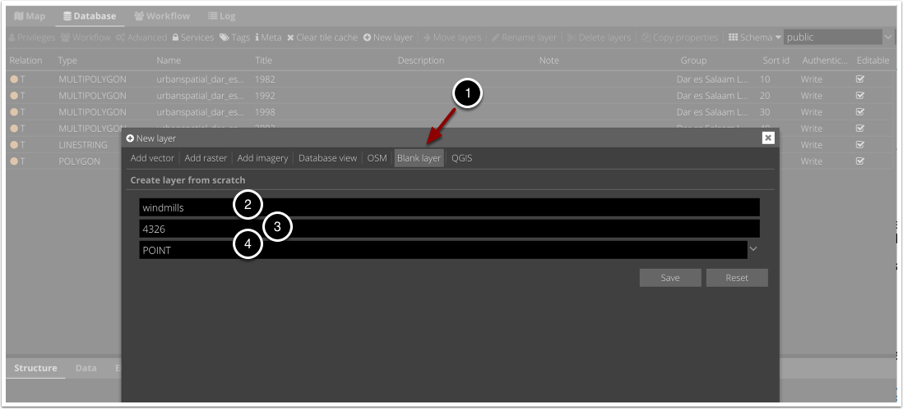

    Nyt lag dialogboks

1. Klik på Blank layer.
#. giv den nye tabel et navn.
#. Sæt EPSG kode for geometri-feltet.
#. Sæt type kode for geometri-feltet.

Hvis du vil have en tabel uden geometri, så slettes geometri-feltet bare efter tabellen er oprettet.

.. _gettingstarted_admin_versioning:

Versionering af data (Track changes)
-----------------------------------------------------------------

Ved versionering af data beholdes alle ændringer i tabellen. Dvs. at den fulde transaktions-historik beholdes. Versionering gør brugerne i stand til at gå tilbage i historien og se hvordan et lag så ud på et bestemt tidspunkt. Versionering virker også som journalisering af alle transaktioner foretaget på laget.

Et versioneret lag fungerer ligesom alle andre lag og kan redigeres på normal vis. GC2 tager sig af versioneringen i baggrunden.

Versionering foregår i WFS laget. Dvs. at det fungerer både ved redigering i GC2's Map fane, men også igennem eksterne WFS editors som f.eks. QGIS.

.. include:: ../../_subs/WARNING_OLD_DOC.rst

**Start "Tracking changes" på et lag**

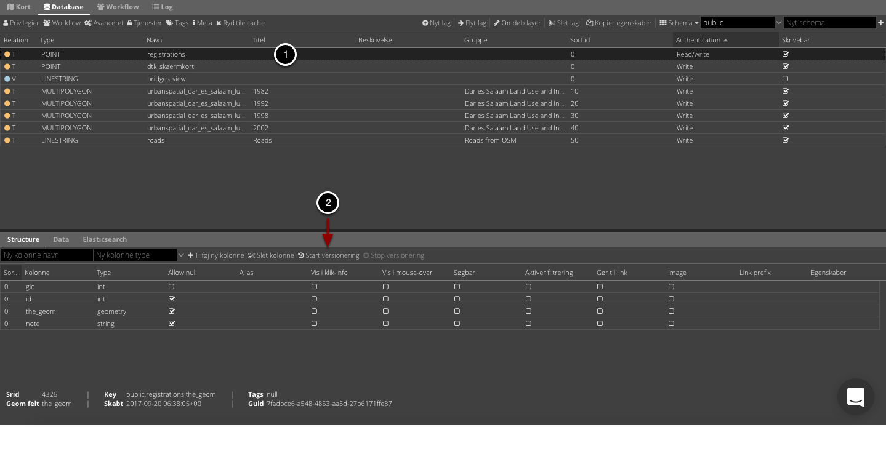

    start versioning

1. Vælg lag ved at klikke på linjen så den bliver grå.
#. Klik på "Start versionering".

**Nye system-felter i tabellen**

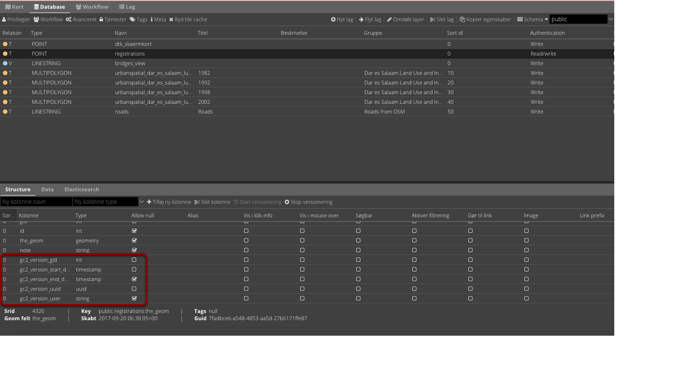

    Nye felter

Lagets tabel får fem nye system-felter (system-felter starter altid med "gc2"). Felter indeholder versionsdata for hver enkelt feature i tabellen. System-felterne er:

**gc2_versions_gid** Er en nøgle, som relaterer en features forskellige versioner. Dvs. er to versioner af denne samme feature, har samme nøgleværdi.

**gc2_version_start_date** Er et tidsstempel, som angiver hvornår versionen er oprettet. Alle features har en værdi i dette felt.

**gc2_version_end_date** Er et tidsstempel, som angiver hvornår versionen er afsluttet. Kun afsluttede versioner har en værdi i dette felt og den aktuelle version har ikke værdi i dette felt.

**gc2_version_uuid** Er en "universally unique identifier" som alle versioner får tildelt. Denne værdi er global unik.

**gc2_version_user** Er den (sub-)bruger, der har skabt versionen.

**Versionsdata i tabellen**

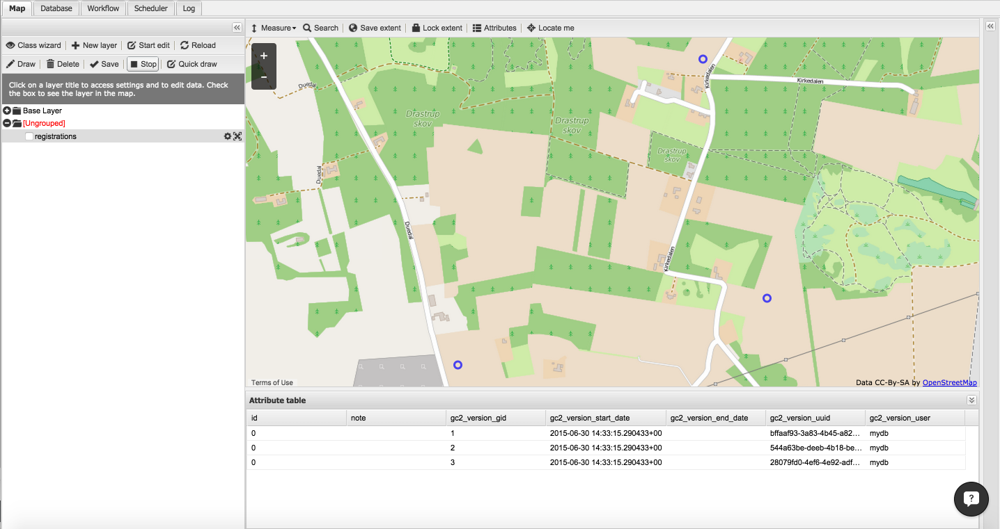

    versionsdata

Dette er et eksempel på versionsdata i tabellen. Denne versionerede tabel har tre nye punkter, som hver har dato/tid for oprettelsen (gc2_version_start_date), et unikt id (gc2_version_uuid) samt hvilken bruger, der har oprettet punkterne (gc2_version_user).

**Se alle versioner**

.. figure:: ../../../_media/versioning-see-all-versions.png
    :width: 600px
    :align: center
    :name: versioning-see-all-versions
    :figclass: align-center

    versionsdata

Som standard vises kun aktuelle features, dvs. dem uden en gc2_version_end_date. Det er muligt at se alle features på en gang.

1. Start redigering af laget.
#. Vælg "all" under "Time slicing", som skal tjekkes af i boksen.
#. Load features.

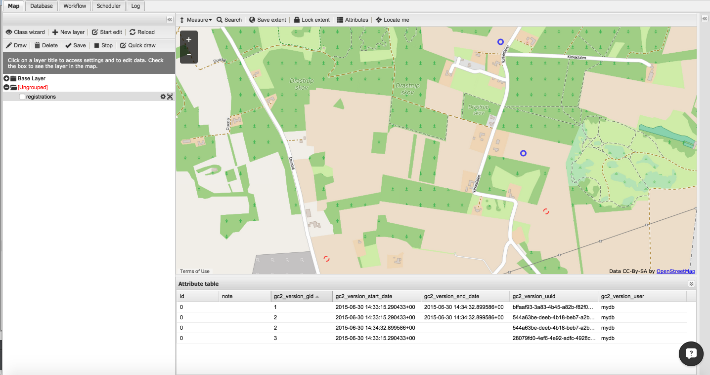

    Eksempel på versioner

Eksemplet viser to aktuelle punkter. Endvidere ses det, at punktet med **gc2_version_gid** = 2 findes i to versioner: En aktuel og en afsluttet. Dvs. at punktet har været redigeret. Punktet med **gc2_version_gid** = 1 er afsluttet og der er ikke andre versioner af dette punkt. Dvs. at punktet er slettet.

Afsluttede versioner vise med rød, stiplet kant. Disse kan ikke redgieres.

**Time slicing**

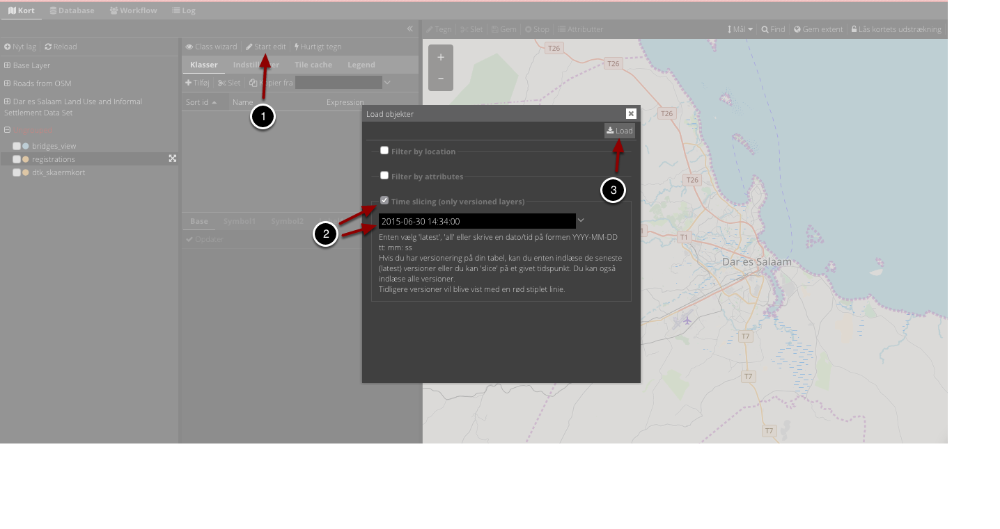

    Timeslicing

Det er muligt at se hvordan et lag så ud på et bestemt tidspunkt.

1. Start redigering af laget.
#. Tjek "Time slicing" af og skriv en dato/tid i formatet yyyy-mm-dd hh:mm:ss fx 2015-06-30 14:34:00. Undlades tiden vil den blive sat til 00:00:00.
#. Load features.

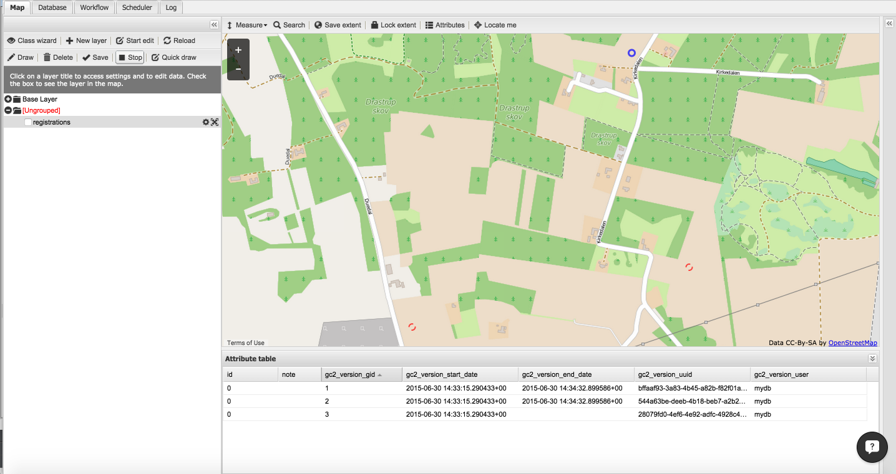

    Timeslicing eksempel

Ved Time slicing vises de versioner, som var aktuelle på den pågældende dato/tid. Dvs. at der kun vises én version pr. feature (**gc2_version_gid** værdierne er unikke). Eksemplet viser, at der var tre aktuelle punkter, hvoraf et stadig er aktuelt (det blå) og to, som senere enten er ændret eller slettet (røde). For de ændrede punkter viser **gc2_version_end_date** tidspunktet for ændringen.

	**Versionering i ekstern editor fx QGIS**

.. figure:: ../../../_media/versioning-example-qgis.png
    :width: 600px
    :align: center
    :name: versioning-example-qgis
    :figclass: align-center

    versionering i QGIS

Versionering foregår i WFS laget. Dvs. at det fungerer både ved redigering i GC2's Map fane, men også igennem eksterne WFS editors som f.eks. QGIS.

Ved brug af standard WFS forbindelsesstrengen vises kun de aktuelle versioner. Dvs. at dette er ikke andersledes end for ikke-versionerede lag:

http://example.com/wfs/mydb/public/4326

Hvis alle versioner skal vises i QGIS bruges denne streng:

http://example.com/wfs/mydb/public/4326/all

Og ved Time slicing bruges denne: (Bemærk "T" mellem dato og tid)

http://example.com/wfs/mydb/public/4326/2015-06-30T14:34:00

.. _gettingstarted_admin_workflow:

Workflow management
-----------------------------------------------------------------

Workflow giver mulighed for at kontrollere redigeringen af et lag i en typisk forfatter-redaktør-udgiver kæde.

Et lag under workflow kontrol fungerer ligesom alle andre lag og kan redigeres på normal vis. GC2 tager sig af workflowet i baggrunden.

Workflow foregår i WFS laget. Dvs. at det fungerer både ved redigering i GC2's Map fane, men også igennem eksterne WFS editors som f.eks. QGIS.

**Start "track changes" på laget.**

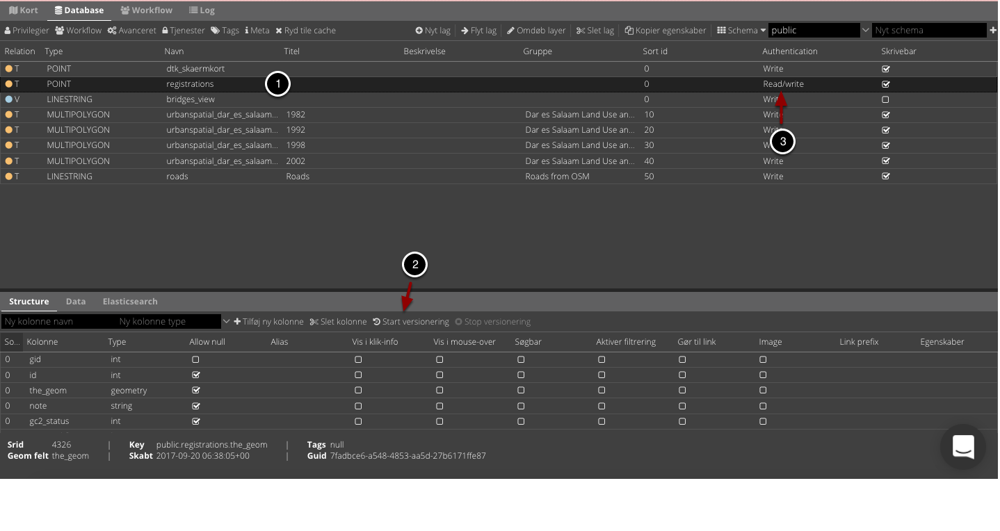

    start versioning

Workflow bygger oven på versionerings-systemet i GC2, så det er nødvendigt at starte "Track changes" på laget.

1. Vælg et lag ved at klikke på linjen så den bliver grå.
#. Klik på "Track changes". Læs mere om "Track changes"
#. VIGTIGT! Husk at sætte Authentication niveauet til "Read/write" på laget.

**Tildel privilegier til sub-brugere**

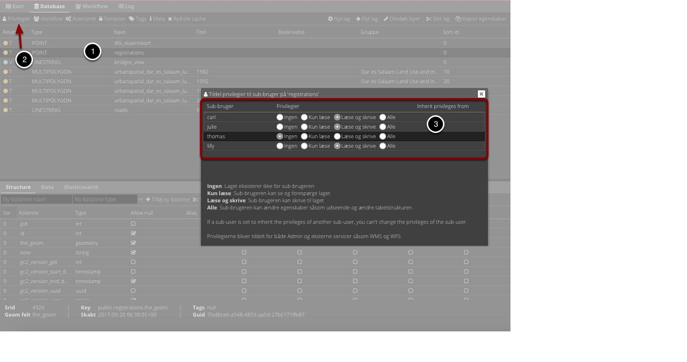

    Workflow

De sub-brugere, som skal have en rolle i workflowet, skal have tildelt privilegier til laget. Læs mere om sub-brugere og privilegier.

1. Vælg et lag ved at klikke på linjen så den bliver grå.
#. Klik på "Privilegier".
#. Sæt privilegiet til "Læse og skrive" (eller "Alle") for hver sub-bruger, der skal have en rolle i workflowet.

**Start Workflow på laget**

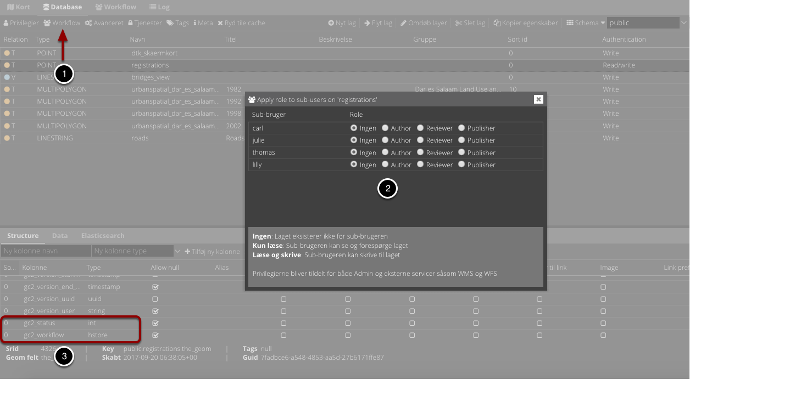

    Start Workflow

1. Start workflow på laget ved at klikke på "Workflow".
#. Workflow dialogen vises.
#. Lagets tabel får to nye system-felter (system-felter starter altid med "gc2"). Felterne indeholder workflow-data for hver enkelt feature i tabellen. Felterne er:

``gc2_status`` Indeholder featurens status, som er enten: 1 = Draft, 2 = Reviewed eller 3 = Published.

``gc2_workflow`` Indeholder workflow-kæden.

**Tildel roller i Workflowet**

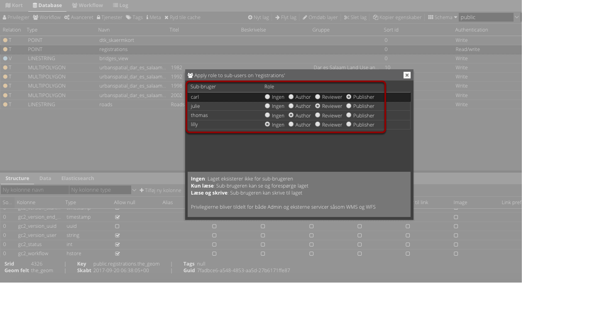

    Workflow roller

En sub-bruger kan have en af følgende roller i et workflow:

**Author** Kan oprette nye features. Kan også ændre en feature, som IKKE er Reviewed eller Published. Dvs. som ikke er kommet videre i workflowet.

**Reviewer** Kan ændre eller godkende en feature. Kan IKKE ændre en feature, som er Published.

**Publisher** Kan ændre eller godkende en feature til endelig udgivelse.

Sub-brugere, som ikke har en rolle i workflowet, kan ikke lave ændringer i laget.

En rolle kan varetages af to eller flere brugere. Fx kan et lag have to Authors.

Bemærk, at det ikke er nødvendigt, at alle roller er besatte. Fx hvis man ønsker at springe Reviewer ledet over, kan dette gøres.

**Workflow fanen**

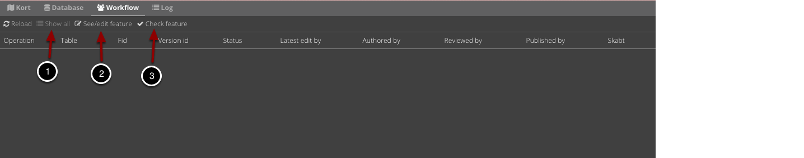

    Workflow fanen

Når et lag er under workflow-kontrol kan alle transaktioner på laget ses i fanen "Workflow". Hver linje er en transaktion. Listen viser kun transaktioner, som er relavante for brugeren, dvs. dem som brugeren skal tage action på.

Eksemplet viser en transaktion på et punkt foretaget af Lilly, som er Author.

Hver transaktion har følgende værdier:

**Operation** Er hvilken operation, der er foretaget på laget: insert, update eller delete.

**Table** Hvilken tabel transaktionen udført på.

**Fid**  Primærnøglens værdi på den feature transaktionen er udført på.

**Version id** Versions-id'ets værdi på den feature transaktionen er udført på.

**Status** Den status featuren har efter transaktionen.

**Latest edit by** Den sub-bruger, som har udført transaktionen.

**Authored by** Den Author, der har oprettet featuren.

**Reviewed by** Den Reviewer, som har godkendt featuren.

**Published by** Den Publisher, som har godkendt featuren.

**Created** Transaktionen tidsstempel.

Knapper i Workflow

1. **Show all**. Viser alle transaktioner. Også den, som ikke er aktuelle for brugeren.
#. **See/edit feature**. Skifter til Map fanen og loader featuren.
#. **Check feature**. Godkender featuren. Svarer til en update af featuren uden at ændre den.

**Efter "Review"**

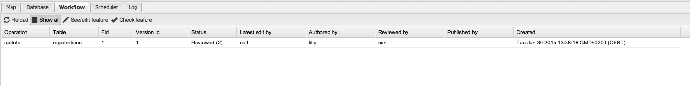

    Workflow status

Eksemplet viser et punkt, som er reviewed (godkendt af Reviewer Carl). Punktet har nu status 2.

**Efter "Publish"**

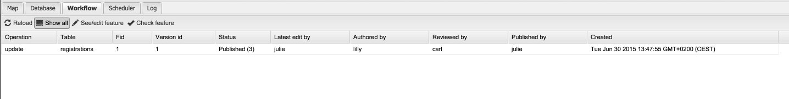

    Workflow status published

Eksemplet viser et punkt, som er published (godkendt af Publisher Julie). Punktet har nu status 3.

**Overspring i Workflow kæden**

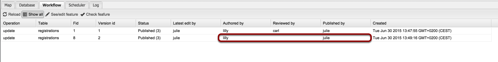

    Workflow overspring

Det er muligt for en bruger at springe et lavere led i workflow-kæden over. Eksemplet viser, at reviewer Carl er sprunget over af publisher Julie.

**Workflow information i data**

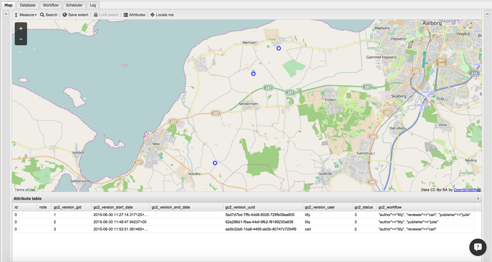

    Workflow visning i data

Workflow informationerne til de enkelte features bliver gemt i lagets tabel i felterne **gc2_status** og **gc2_workflow**.

**gc2_status** Angiver status 1-3.

**gc2_workflow** Indeholder workflow-kæden. Kæden er en liste i formen fx: "author"=>"lilly", "reviewer"=>"carl" Denne kæde viser, at punktet er oprettet af Lilly, reviewed af Carl, men stadig ikke godkendt af en publisher.

**Brug af ekstern editor i Workflow**

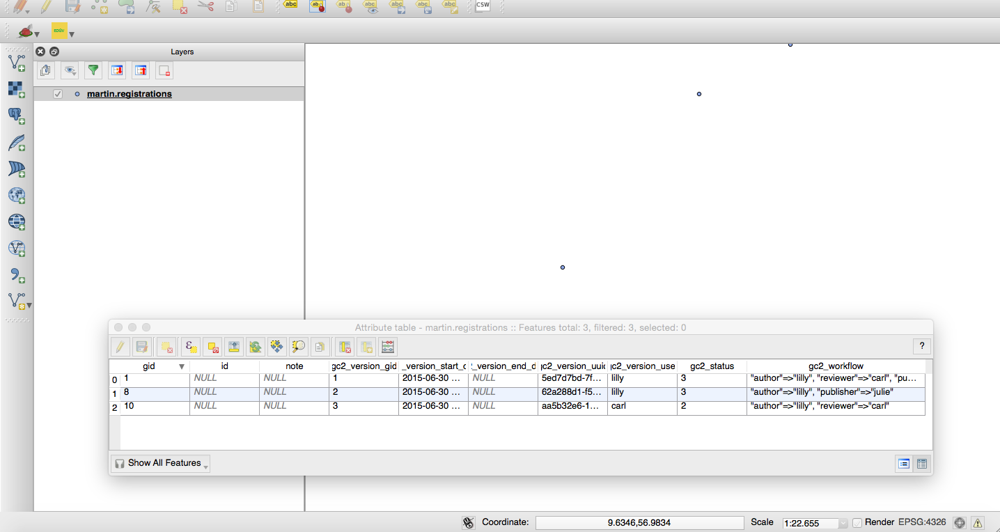

    Workflow i QGIS

Workflow foregår i WFS laget. Dvs. at det fungerer både ved redigering i GC2's Map fane, men også igennem eksterne WFS editors som f.eks. QGIS.

Laget hentes ind og redigeres på sædvanlig vis i QGIS.

.. _gettingstarted_admin_log:

Log
-----------------------------------------------------------------

TBD

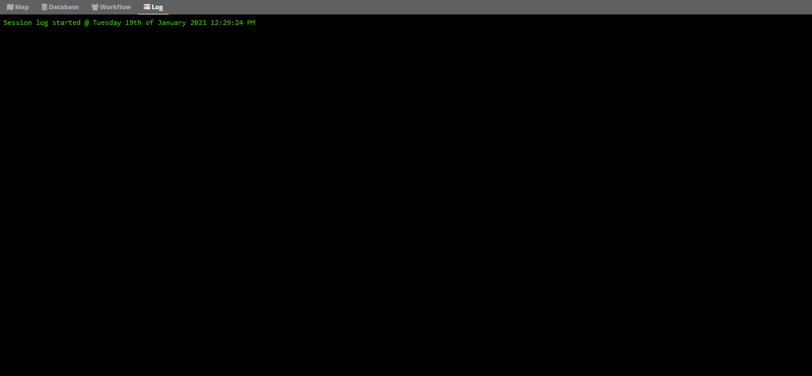

    Log

.. _gettingstarted_admin_layer:

Lag
-----------------------------------------------------------------

Alt data der udstilles igennem GC2 er opdelt i lag. Disse ligger i et skama, som igen ligger i en database. Databasen er oprettet når der oprettes en bruger, derefter kan der oprettes flere skemaer. Subusers kan også have deres eget skema, se mere her :ref:`subuser`.

Der findes flere forskellige lag:
* TBD

Før man begynder at lave lag i skemaet, er det en god idé at sørge for man ikke står i ``public``-skemaet. Dette skema har en bestemt betydning i PostgreSQL-databasen.

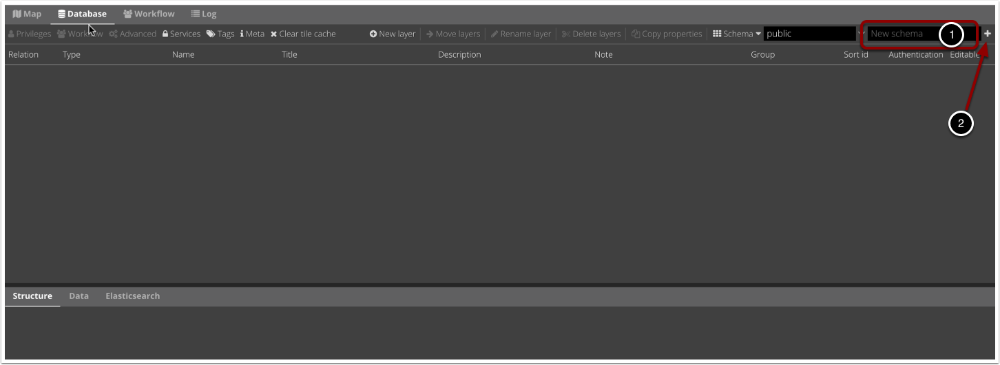

    Lav nyt skema

Start med at indtaste skemanavnet, og tryk derefter på ``+``-tegnet for at oprette et nyt skema. Derefter er det muligt at gå til det nye skema ved hjælp af drop-down.

.. _layer_create:

Nyt Lag
~~~~~~~~~~~~~~~~~~~~~~~~~~~~~~~~~~~~~~~~~~~~~~~~~~~~~~~~~~~~~~~~~~

Man kan tilgå funktionen ``Nyt Lag`` (**1**) i enten :ref:`gettingstarted_admin_map` eller :ref:`gettingstarted_admin_database`.

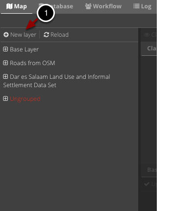

    ``Nyt Lag`` i ``Map``-fanen

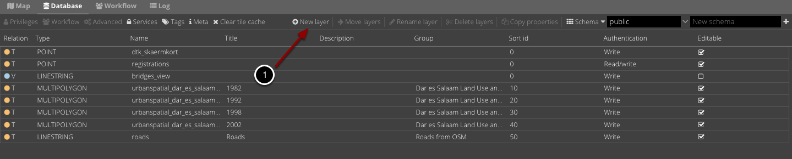

    ``Nyt Lag`` i ``Database``-fanen

Herfra er der flere muligheder for at danne nye lag til det aktive skema.

.. _layer_create_vector:

Vektor
*****************************************************************

.. include:: ../../_subs/WARNING_OLD_DOC.rst

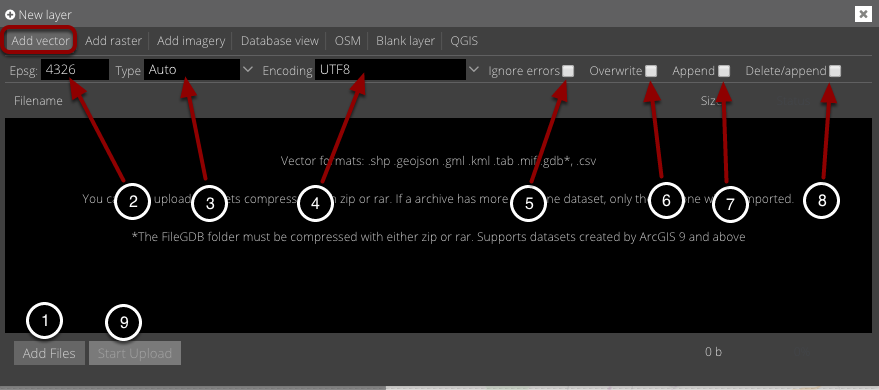

    Vektor-lag dialog

For at uploade vektor-filer og dermed danne lag på baggrund af disse, følges denne beskrivelse. Numre passer med :numref:`layer-create-vector`:

#. Klik på ``Tilføj filer``, eller træk flere filer ad gangen ind i dialogboksen. Følg hjælpeteksten i boksen.

#. Sæt koordinatsystem som filerne skal ende i . Dette kan f.eks. være ``25832`` for ``utm32`` eller ``4326`` for ``wgs84``.

#. Hvis man uploader ``.shp``-filer, er det en god idé at definere geometri-typen, ellers er der risiko for at geometrien bliver læst som blandet.

#. Hvis attributterne i datafilerne indeholder ``ASCII``, skal ``encoding`` defineres korrekt. Eller kan tegn ikke vises korrekt (``Æ``, ``Ø``, ``Å`` blandt andet.)

#. Hvis data indeholder fejl, så spring disse over.

#. Hvis der allerede eksisterer et lag med samme navn som filen man uploader, så overskriv det eksisterende lag.

#. Hvis der allerede eksisterer et lag med samme navn som filen man uploader, så overskriv ikke, men læg data i samme lag.

#. Hvis denne er slået til bliver et lag med samme navn som filen man uplader ikke overskrevet eller lagt til - men derimod tømt og indhold fra den nye fil bliver lagt i laget. Man kan bruge denne funktion til at undgå at skulle fjerne views der afhænger af laget.

#. Klik ``Start upload``

Efter upload er færdig, er de nye datasæt tilgængelige i ``Map``-fanen, hvor det har fået en standard-tematisering, og i ``Database``-fanen hvor det er muligt at ændre lagets egenskaber.

.. _layer_create_raster:

Raster & billede
*****************************************************************

.. include:: ../../_subs/WARNING_OLD_DOC.rst

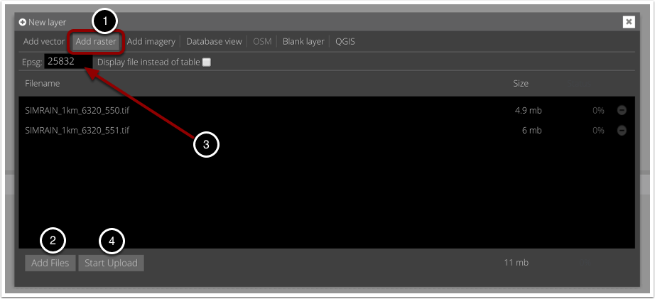

    Raster- & Billed-lag dialog

For at uploade raster-filer og dermed danne lag på baggrund af disse, følges denne beskrivelse. Numre passer med :numref:`layer-create-raster`:

#. Vælg fanen ``Tilføj Raster``
#. Klik på ``Tilføj filer``, eller træk flere filer ad gangen ind i dialogboksen. Følg hjælpeteksten i boksen.
#. Sæt koordinatsystem som filerne skal ende i . Dette kan f.eks. være ``25832`` for ``utm32`` eller ``4326`` for ``wgs84``.
#. Klik ``Start upload``

Efter upload er færdig, er de nye datasæt tilgængelige i ``Map``-fanen, hvor det har fået en standard-tematisering, og i ``Database``-fanen hvor det er muligt at ændre lagets egenskaber.

.. _layer_create_view:

Database-view
*****************************************************************

Du kan skabe et view ovenpå en SELECT forespørgelse, der giver forespørgelsen et navn som du kan referere som en normal tabel. Views er meget veleget til fx at filtrere og sortere data, uden at skulle oprette en ny tabel.

Views kan bruges i næsten alle sammenhænge som en rigtig tabel.

Opret view
*****************************************************************

.. figure:: ../../../_media/layer-create-view.png
    :width: 400px
    :align: center
    :name: layer-create-view
    :figclass: align-center

    Opret nyt view

#. Klik på "Nyt lag".
#. Klik på "Database view".
#. Giv view'et et navn.
#. Skriv SELECT SQL, som skal definere view'et.
#. MATERIALIZE
#. Klik "Skab".

En tabel og view skal have en primær-nøgle. GC2 detekterer primær-nøgler på tabeller, men views har ikke primær-nøgler, så derfor falder GC2 tilbage på feltet "gid". Dvs. at et view skal have et felt "gid" med unikke værdier. Det skal også have et geometri-felt, så det dukker op i listen over lag (der er ingen krav til navngivningen af geometri-felter). Hvis en tabel er oprettet gennem GC2, vil tabellen have gid som primær-nøgle. Så en SELECT som denne vil virke:

``SELECT * FROM foo WHERE bar=1``

Udvælges der ikke med * skal gid og geometri-felt vælges:

``SELECT gid,the_geom FROM foo WHERE bar=1``

Der kan også skabes et "gid" felt med "As" syntax. Her bliver der skabt et view med ét punkt:

``SELECT 1 As gid, ST_SetSRID (ST_Point(-123.365556, 48.428611),4326)::geometry(Point,4326) AS the_geom``

.. _layer_create_blank:

Tomt
*****************************************************************

TBD

.. _layer_create_qgis:

QGIS-lag
*****************************************************************

TBD - ref to qgis

.. _layer_properties:

Egenskaber
~~~~~~~~~~~~~~~~~~~~~~~~~~~~~~~~~~~~~~~~~~~~~~~~~~~~~~~~~~~~~~~~~~

TBD

.. _layer_properties_privileges:

Låse Lag Og Tildele Rettigheder
~~~~~~~~~~~~~~~~~~~~~~~~~~~~~~~~~~~~~~~~~~~~~~~~~~~~~~~~~~~~~~~~~~

Som udgangspunkt er alle lag åbne. Hvis man vil beskytte et lag, er det muligt at låse det.
For at låse et lag vælges ``Read/Write`` i authentication kolonnen.

Det er muligt at sætte rettighederne på lagniveau. Disse rettigheder gælder når man tilgår laget igennem Vidi eller eksterne klienter.

Det er muligt at sætte følgende niveauer:

* ``Write`` - Laget kan læses af alle. For at editere skal brugere være logget ind i klienten.

* ``Read/Write`` - Laget kan kun læses af brugere med adgang. For at læse eller skrive skal brugeren være logget ind.

* ``None`` - Laget er åbent for alle.

.. _layer_styling:

Tematisering
~~~~~~~~~~~~~~~~~~~~~~~~~~~~~~~~~~~~~~~~~~~~~~~~~~~~~~~~~~~~~~~~~~

Alt data der udstilles igennem GC2 er opdelt i lag. Disse ligger i et skama, som igen ligger i en database. Databasen er oprettet når der oprettes en bruger, derefter kan der oprettes flere skemaer. Subusers kan også have deres eget skema, se mere her :ref:`subuser`.

Der findes flere forskellige lag:
* x

.. _layer_class_wizard:

Class Wizard
*****************************************************************

For nemt at oprette en tematisering, er der lavet en wizard.

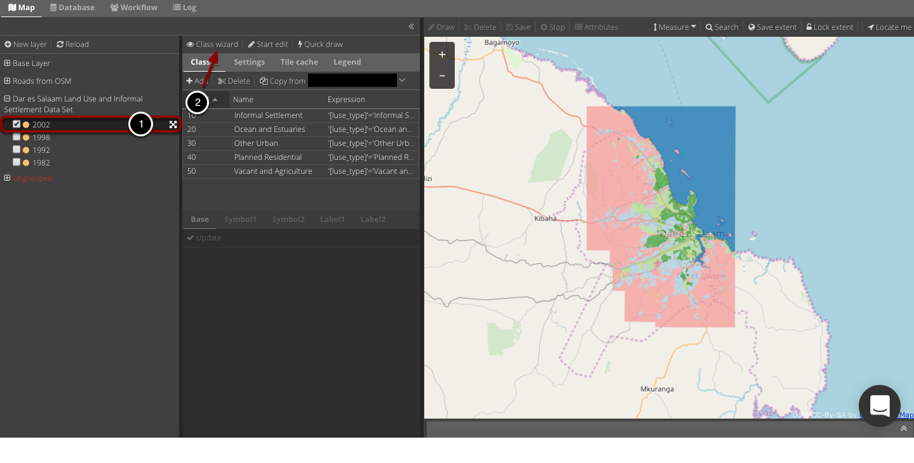

    ``Class wizard`` i ``Map``-fanen

Start med at vælge det lag du gerne vil tematisere. Lagene er samlet i de grupper som er defineret i deres :ref:`layer_properties`.

1. Vælg relevant lag der skal tematiseres.

2. Klik på ``Class Wizard``

Tematiseringen af styres igennem regler kaldet ``class``. Dette svarer til et reglset i MapServer-komponenter, og mange af de samme tematiseringsmuligheder er i GC2.

.. _layer_wizard:

Wizard-typer
*****************************************************************

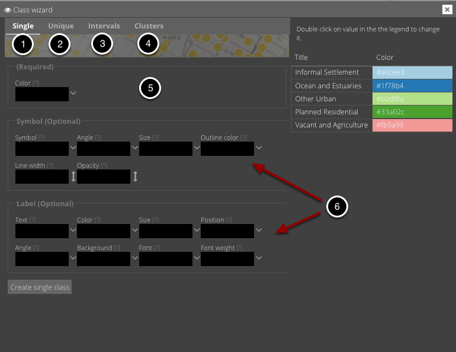

    ``Class wizard`` viser altid den sidst brugte opsætning

Man bliver præsenteret for 4 faner med hver sin tematisering. Felterne i (**6**) er tilgængelige for alle 4 faner, hvorimod de obligatoriske felter i (**5**) er forskellige for hver fane.

1.  ``Enkelt`` er den mest simple tematisering. Denne stilart bliver sat når der bliver uploaded ny data. Der bliver lavet en ``class`` med den valgte farve.
    * ``Farve`` - den faste farve som features får.

2. ``Unique`` laver en ``class`` for hver unik værdi i det valgte felt.
    * ``Felt`` - vælg hvilken kolonne værdierne skal læses fra.
    * ``Farve`` - Det er muligt at vælge tilfældige farver, eller en af de forud-defineret farve-paletter.

.. note::
    Bemærk at denne stilart ikke sikrer at nye unikke værdier får deres egen tematisering. Dette er en enten-eller regl. Hvis der kommer features som ikke er defineret som en ``expression``, vil de ikke blive udtegnet.

3. ``Intervaller`` laver en ``class`` for et interval. Denne funktion virker kun på nummeriske kolonner.
    * ``Type`` - Det er muligt at vælge mellem  ``Equal`` el. ``Quantile`` til beregningsmetoden for intervallerne.
    * ``Nummerisk felt`` - Hvilken kolonne skal bruges til beregningen.
    * ``Antal af farver`` - Vælg antal af intervaller der skal beregnes.
    * ``Start Farve`` - Vælg den indledende farve
    * ``Slut Farve`` - Vælg den afsluttende farve

4. ``Clusters`` laver en gruppering af punkter eller features. Det bliver lavet en ``class`` for grupperingen, og den enkelte feature.
    * ``Afstand`` - heltal i ``pixels`` som angiver hvor tæt features skal ligge på hinanden for at indgå i en cluster.

.. _layer_wizard_symbol:

Symbol
*****************************************************************

.. include:: ../../_subs/WARNING_OLD_DOC.rst

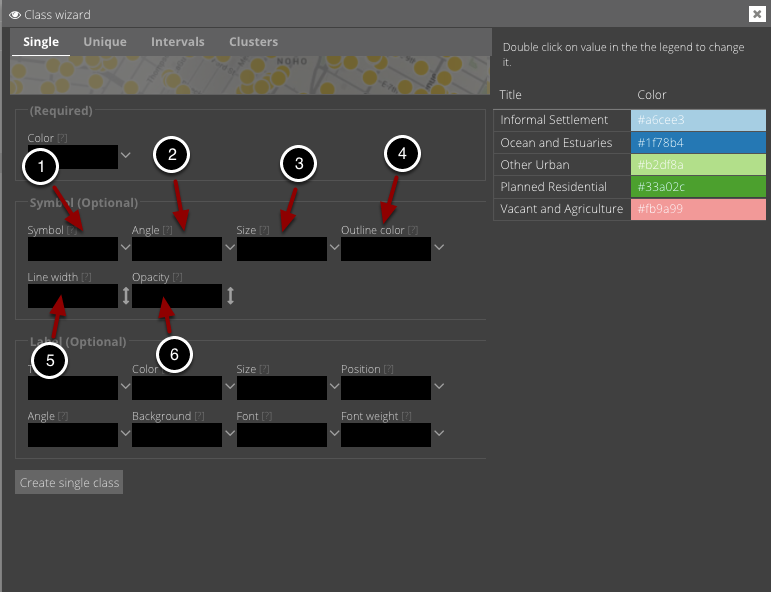

    Indstillinger for ``Symbol``

1. ``Symbol`` - Angiv hvilket symbol der skal bruges. Hvis feltet er tomt bliver flader og linjer udtegnet som normalt.

2. ``Angle`` - Symbolets rotation i ``°`` mod uret. [#combo]_

3. ``Size`` - Symbolets højde i ``pixels``. [#combo]_

4. ``Outline farve`` - Farve der bruges i kanten af flader, og på bestemte symboler. Har ingen effekt på linje-lag.

5. ``Line width`` - Tykkelse på linjer i ``pixels``

6. ``Gennemsigtighed`` - Angiv gennemsigtighed på objektet på en skala fra ``1 - 100`` hvor ``100`` er solid.

.. _layer_wizard_label:

Label
*****************************************************************

.. include:: ../../_subs/WARNING_OLD_DOC.rst

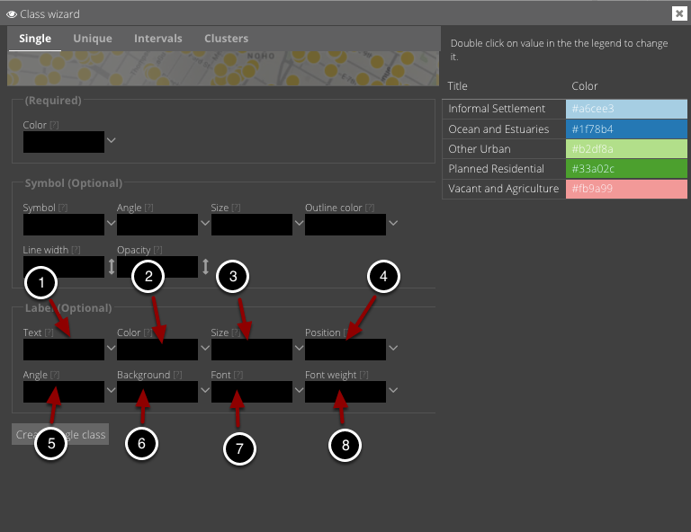

    Indstillinger for ``Label``

1. ``Text`` - Tekst der skal vises som label. [#combo]_

.. note::
    Det er også muligt at angive flere kolonner, eller sammensatte tekster.

    ``No. [id] \n [text]`` vil samle teksterne fra ``id`` og ``text``.

2. ``Color`` - Farce for label. [#combo]_

3. ``Size`` - Størrelse på label i ``pixels``. [#combo]_

4. ``Position`` - Position af label relativt til ankerpunkt

5. ``Angle`` - Labels rotation i ``°`` mod uret. [#combo]_

6. ``Background`` - Baggrundsfarve for label. Dette vil danne en polygon bag teksten som kan gøre den mere læsbar.

7. ``Font`` - Skrifttype for label

8. ``Font weight`` - Vægt af skrifttype. ``Normal``, ``Bold``, ``Italic``, ``Bold italic``

.. _styling_manual:

Manuel tematisering
*****************************************************************

.. include:: ../../_subs/WARNING_OLD_DOC.rst

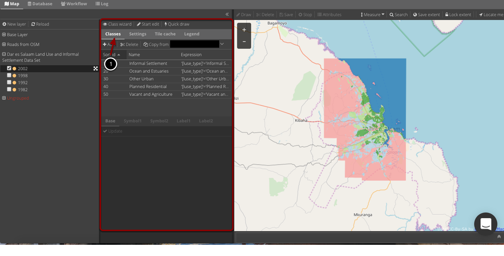

    Manuel adgang til ``class``

Efter man indledningsvis har brugt ``Class Wizard`` til at oprette den ønskede tematisering, er det muligt at lave en yderligere tilpasning.

1. Åbn panelet ved at klikke på det valgte lag.

.. _styling_manual_classes:

Klasser
*****************************************************************

.. include:: ../../_subs/WARNING_OLD_DOC.rst

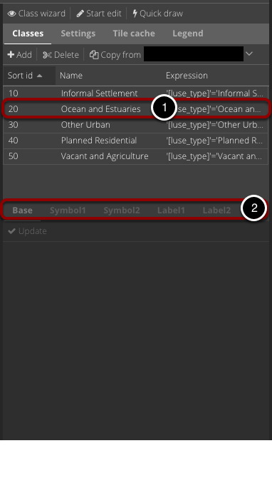

    ``class``-panel

1. Det øverste grid vider de eksiterende klasser. Der skal være mindst 1 klasse for at laget kan blive vist på kortet.Hvis en klasse bliver valgt vil værdierne blive vist i panelet under.

2. Egenskaber opdelt i fanerne: ``Base``, ``Symbol1``, ``Symbol2``, ``Label1``, ``Label2``

.. _styling_manual_base:

Base
*****************************************************************

.. include:: ../../_subs/WARNING_OLD_DOC.rst

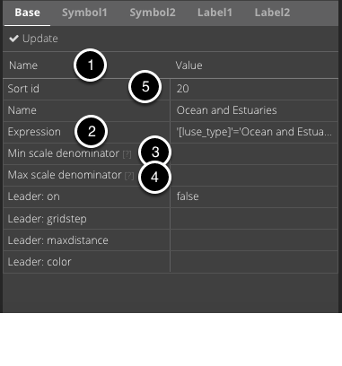

    ``class``-panel

I denne fase er de grundlæggende egenskaber.

1. ``Name`` - Klassens navn. Denne bliver vist i signaturforklaringen.

2. ``Expression`` - Hver feature i laget bliver test imod dette udtryk. Kun hvis der returneres ``true`` til udtrykket bliver det tegnet ud. Hvis expression er tom, vil alle features udtegnes med denne klasse. `Læs mere om expressions her <https://mapserver.org/mapfile/expressions.html>`_

3. ``Min scale denominator`` - bestemmer ved hvilken minimums-skala denne class skal udtegnes. Bliver angivet som ``24000`` for ``1:24000``.

4. ``Max scale denominator`` - bestemmer ved hvilken maksimum-skala denne class skal udtegnes. Bliver angivet som ``24000`` for ``1:24000``.

5. ``Sort id`` - Angiver hvilken rækkefølge denne class har i signaturforklaringen. Denne indstilling ændrer ikke for rækkefølgen af features der bliver udskrevet i kortet.

.. _styling_manual_symbol:

Symbol1/Symbol2
*****************************************************************

.. include:: ../../_subs/WARNING_OLD_DOC.rst

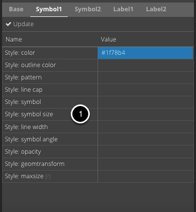

    ``Symbol*``-panel

Det er muligt at angive 2 symboler i samme ``class``. ``Symbol1`` vil være placeret under ``Symbol2``. Dette gør det muligt at lave en mere komplekt symbologi.

1. ``Symbol size``, ``Symbol angle`` [#combo]_

.. _styling_manual_label:

Label1/Label2
*****************************************************************

.. include:: ../../_subs/WARNING_OLD_DOC.rst

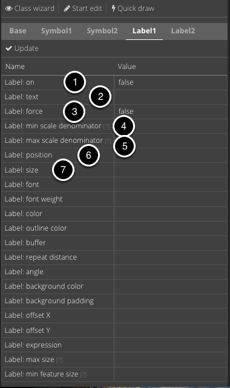

    ``Symbol*``-panel

Det er muligt at angive 2 labels i samme ``class``. Dette gør det muligt at lav ew

1. ``On`` - Sæt denne til ``true`` for at vise labels.

2. ``Text`` - Tekst der skal vises som label. [#combo]_

.. note::
    Det er også muligt at angive flere kolonner, eller sammensatte tekster.

    ``No. [id] \n [text]`` vil samle teksterne fra ``id`` og ``text``.

3. ``Force`` - Gennemtvig udskrivning af label, på trods af kollisioner.

4. ``Min scale denominator`` - bestemmer ved hvilken minimums-skala denne class skal udtegnes. Bliver angivet som ``24000`` for ``1:24000``.

5. ``Max scale denominator`` - bestemmer ved hvilken maksimum-skala denne class skal udtegnes. Bliver angivet som ``24000`` for ``1:24000``.

6. ``Position`` - Position af label relativt til ankerpunkt

7. ``Size`` - Størrelse på label i ``pixels``. [#combo]_

.. _styling_qgis:

QGIS
*****************************************************************

Det er også muligt at tematisere alle sine lag på én gang, eller enkeltvis med at uploade et QGIS-projekt som beskrevet her: :ref:`layer_create_qgis`. Tematiseringen vil i vid udstrækning blive overført fra projektet.

.. note::
    Hvis lagene bliver tematiseret gennem QGIS-projekt skal man være opmærksom på at hele projektet skal læses af MapServer inden der kan returneres et svar til klienten. Det betyder at man kan hente et væsentligt performance-boost ved at tematisere sine lag igennem MapServer.

    Hvis man angiver sin tematisering igennem QGIS første gang, vil ændringer i :ref:`styling_manual` overskrive projektet.

.. rubric:: Footnotes

.. [#combo] Combobox - Man kan angive en fast værdi, eller koble til en kolonne.

Privilegier
=================================================================

Det er muligt at styre rettighederne for den enkelte subbruger under menupunktet ``Privilegier``.

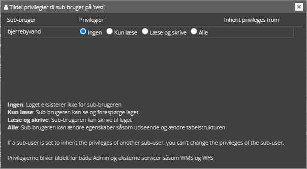

Hvis man er logget ind som databaseuser, er det muligt at sætte rettighederne for den enkelte subbruger. Bemærk at dette ikke berører de lag, der i forvejen er sat til offentlige.

Eksempel - Authentication
-----------------------------------------------------------------

I dette eksempel låses et lag og der tildeles rettigheder til det låste lag til en subbruger.

Der er lavet en subbruger , der hedder reader, som skal have læse rettigheder til et lag.

1. Login med din admin bruger, så du kan se alle subbrugere.
2. Tryk på tandhjulet for se de lag, der ligger under subbrugeren.

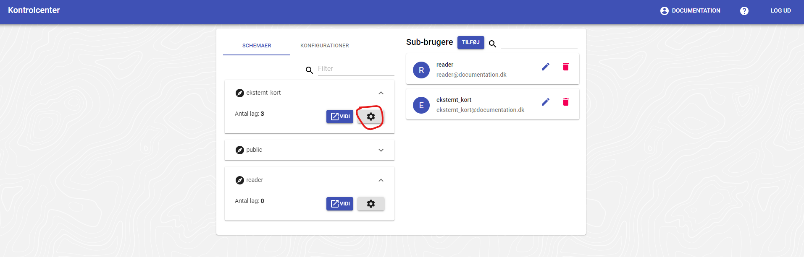

3. Tilføj authentication ved at klikke på et lag og ændre ``Write`` til ``Read/Write`` i ``Authentication`` kolonnen til højre. Dobbel klik på write.

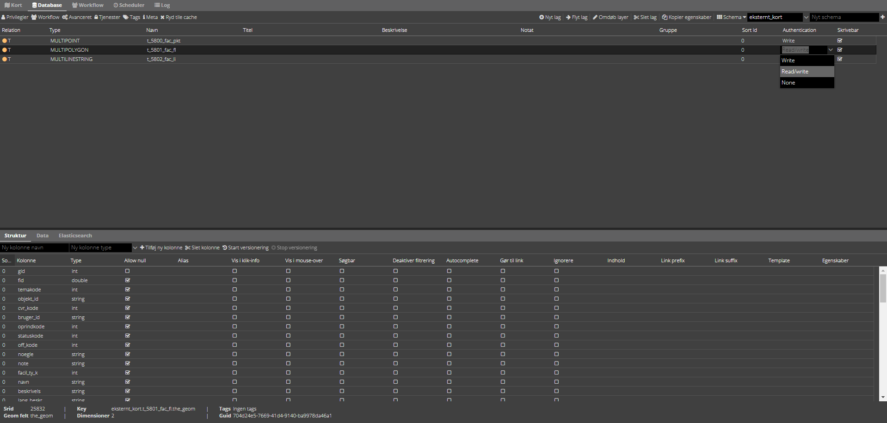

4. Tildel rettigheder ved at klikke på et lag og derefter ``Privilegier`` i øverste venstre hjørne.

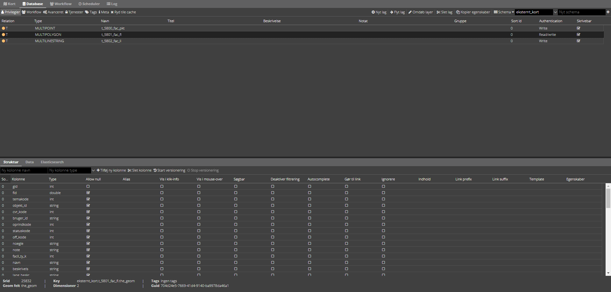

5. Klik på ``Kun Læse``.

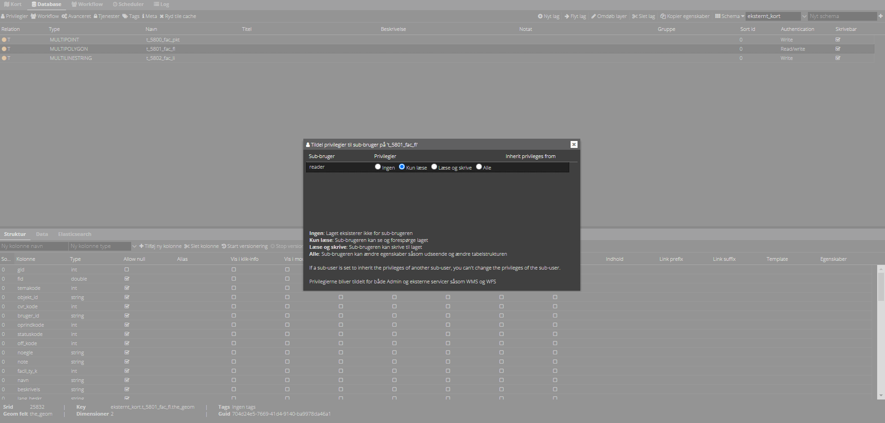

For at kunne se det låse lag, skal der logges ind ved at trykke på låse ikonet på Vidi.

Kald Lag Med Authentication
-----------------------------------------------------------------

Hvis du ønsker at kalde et lag, der har read/write authentication slået til kan det gøres på følgende måde.

1. Klik på den tandhjulet for den subbruger, der har laget, som er låst.

2. Click på ``Tjenester`` og tilføj et password i ``HTTP Basic Auth password for WMS and WFS`` og click opdater.

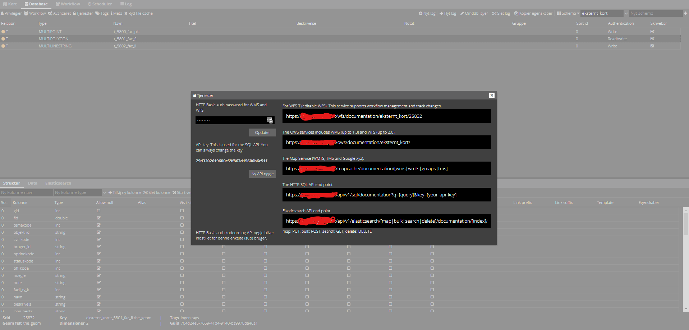

3. Det er derefter muligt at logge ind med subbrugeren og det password du lige har lavet, hvis du f.eks. kalder nedenståenden url:

https://myDomain.com/ows/[subbruger]@[database]/wfs?service=wfs&request=getfeature&version=2.0.0&TYPENAMES=[database:subbruger.lag]&MAXFEATURES=1

.. _otherlayers:

Tilføj andre lagtyper
=================================================================

.. include:: ../../_subs/WARNING_OLD_DOC.rst

Tilføj WMS kilde
-----------------------------------------------------------------

Tilføj lag fra en Web Map Service (WMS)

.. include:: ../../_subs/WARNING_OLD_DOC.rst

Opret nyt lag
*****************************************************************

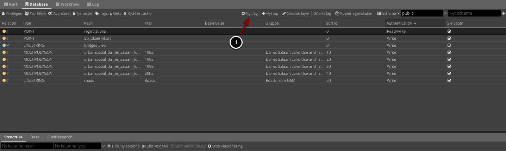

    Nyt lag

1. Start med at oprette et nyt lag.

Nyt blankt lag
*****************************************************************

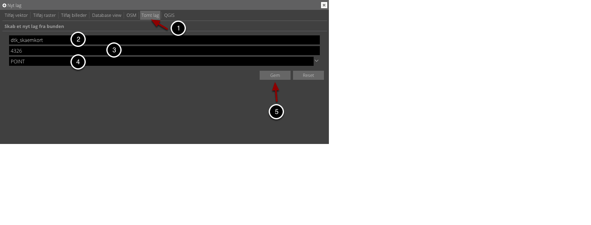

    Nyt tomt lag

1. Vælg at oprette et Tomt lag.
#. Giv det et navn.
#. Vælg den EPSG kode som WMS'en skal forespørges med. Dvs. at WMS'en skal acceptere den valgte kode.
#. Geometri typen er underordnet, da laget ikke skal indeholde geometri
#. Opret laget.

Åben avancerede indstillinger for laget
*****************************************************************

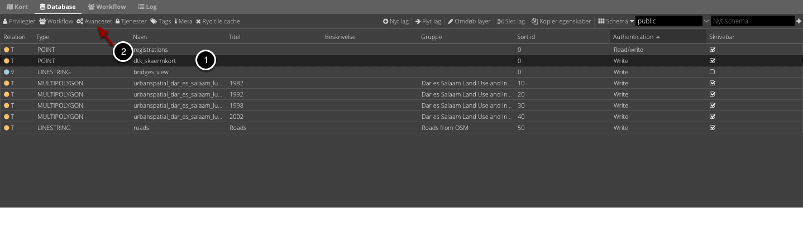

    Nyt lag

1. Klik på det nye lags linje, så den bliver sort.
#. Klik på 'Avanceret'.

Skriv WMS url'en ind
*****************************************************************

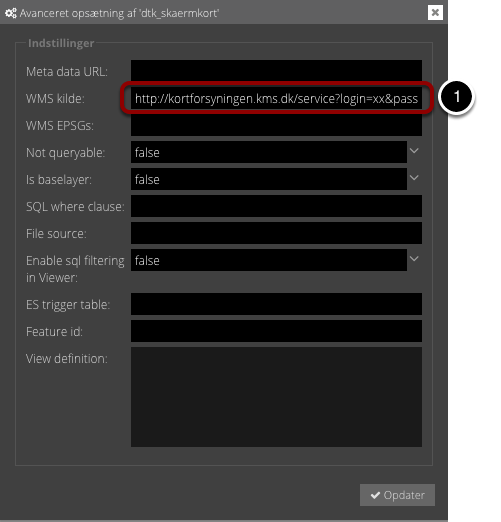

    Nyt lag

1. Skriv en valid WMS GetMap url ind. Laget kan nu anvendes som et normalt lag.

Parameterne WIDTH, HEIGHT og BBOX er ikke nødvendige og vil blive ignoreret.

LAYERS kan indeholde flere lag. I så fald vil de blive merged sammen i GC2 laget.

Brug af database view
-----------------------------------------------------------------

Du kan skabe et view ovenpå en SELECT forespørgelse, der giver forespørgelsen et navn som du kan referere som en normal tabel. Views er meget anvendelige til fx at filtrere og sortere data, uden at skulle oprette en ny tabel.

Views kan bruges i næsten alle sammenhænge som en rigtig tabel.

Opret view
*****************************************************************

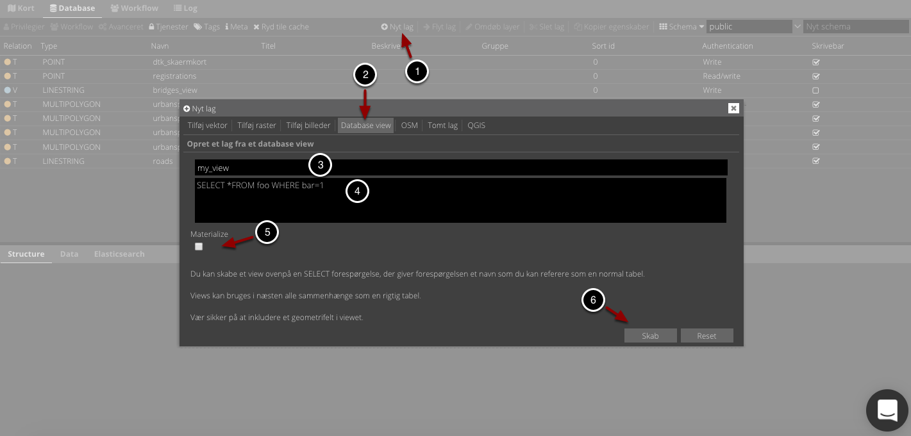

    Nyt lag dialogboks

1. Klik på "Nyt lag".
#. Klik på "Database view".
#. Giv view'et et navn.
#. Skriv SELECT SQL, som skal definere view'et.
#. MATERIALIZE
#. Klik "Skab".

En tabel og view skal have en primær-nøgle. GC2 detekterer primær-nøgler på tabeller, men views har ikke primær-nøgler, så derfor falder GC2 tilbage på feltet "gid". Dvs. at et view skal have et felt "gid" med unikke værdier. Det skal også have et geometri-felt, så det dukker op i listen over lag (der er ingen krav til navngivningen af geometri-felter). Hvis en tabel er oprettet gennem GC2, vil tabellen have gid som primær-nøgle. Så en SELECT som denne vil virke:

SELECT * FROM foo WHERE bar=1

Udvælges der ikke med * skal gid og geometri-felt vælges:

SELECT gid,the_geom FROM foo WHERE bar=1

Der kan også skabes et "gid" felt med "As" syntax. Her bliver der skabt et view med ét punkt:

SELECT 1 As gid, ST_SetSRID (ST_Point(-123.365556, 48.428611),4326)::geometry(Point,4326) AS the_geom

Håndtering af views
*****************************************************************

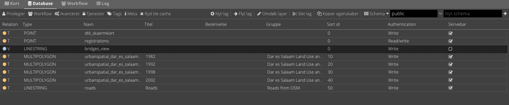

    Database fanen

Views opfører sig ligesom tabeller i næsten alle sammenhænge. For at kunne kende views fra rigtige tabeller, har prikken i venstre side af lag-listen en blå farve.

En forskel på views og tabeller er, at views der kombinerer data fra forskellige tabeller ikke kan redigeres.

Se et eksisterende views definition
*****************************************************************

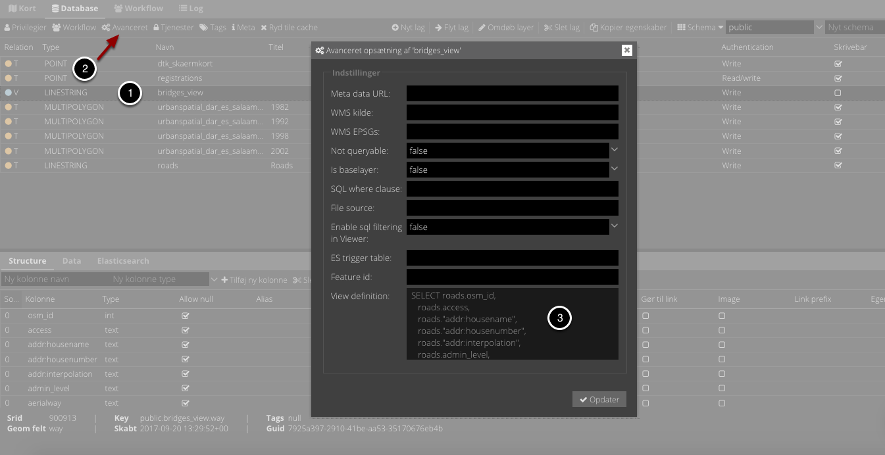

    Se view definintion

1. Vælg et view-lag i listen, så baggrunden bliver grå.
#. Klik på Advanced.
#. SELECT SQL'en, som definerer view'et, kan aflæses i View definition.

.. _layer_faq:

Oftest stillede spørgsmål
=================================================================

Under opsætning og drift kommer man tit ud i situationer hvor det kan være nødvendigt at justere opsætningen på et lag. Herunder er der nogle eksempler på ændringer.

TBD