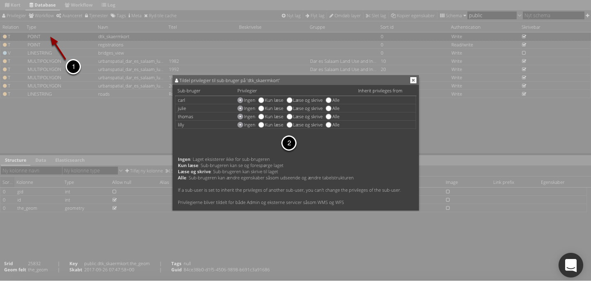
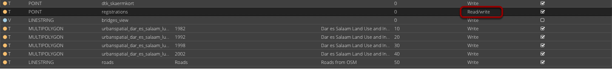
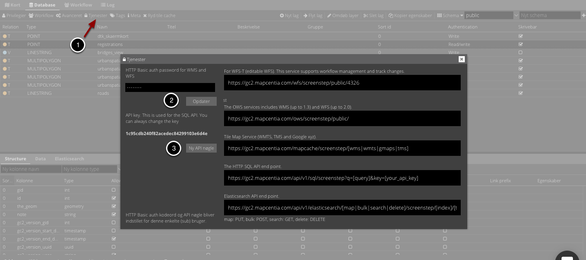

.. _subuser:

#################################################################
Subuser
#################################################################

.. topic:: Overview

    :Date: |today|
    :GC2-version: 2020.12.0
    :Forfatter: `giovanniborella <https://github.com/giovanniborella>`_, `GEOsmeden <https://github.com/geosmeden>`_

.. contents:: 
    :depth: 3

*****************************************************************
Subusers
***************************************************************** 

.. include:: ../../_subs/NOTE_GETTINGSTARTED.rst

.. include:: ../../_subs/WARNING_OLD_DOC.rst

Subuser
=================================================================

Når man indlesningsvis opretter en bruger på gc2, bliver dette toppen rettigheds-hierarkiet. Det er muligt at lave underbruger med forskellige rettigheder i databasen. Dette kan være hensigtsmæssigt hvis man har ikke-offentlige lag som skal deles med eksempelvis eksterne samarbejdspartnere.

Det er som udgangspunkt kun databasebrugeren der kan oprette subusers.

.. note::
    Selv om der opsættes meget få rettigheder for subuser, vil denne altid kunne se andre skemaer i samme database. Også selv om subuser ikke har rettighed til at tilgå nogen lag i de nævnte skemaer.

.. _subuser_create:

Opret subuser
-----------------------------------------------------------------

For at oprette en subuser, navigeres der til :ref:`gettingstarted_dashboard`.

.. figure:: ../../../_media/subuser-create.png
    :width: 400px
    :align: center
    :name: subuser-create
    :figclass: align-center

    Opret subuser

Der angives følgende:

* Brugernavn for subuser

* Mail-adresse - Denne kan benyttes til at genskabe password.

* Password x2 - Indledende kodeord for subuser.

* Nedarv rettigheder - Der er her muligt at koble rettighederne for den subuser man er ved at lave med en anden. Dette er nærmere beskrevet i næste afsnit.

Når man er færdig klikkes der på ``Gem``

Subuser som gruppe
-----------------------------------------------------------------

Et typisk use-case er hvor man ønsker at opdele adgangen til data mellem interne og eksterne interessenter.

I dette tilfælde vil man indledningsvis oprette 1 eller flere subusere som grupper. Man kan oprette en subuser ``ekstern`` som håndterer rettigheder for alle udenfor organisationen, ``intern_read`` for interne som ikke skal have skrive-rettigheder, og ``Admin`` for subusers som skal have rettighed til alt.

Når man efterfølgende opretter en subuser, vælger man hvilken "gruppe" den pågældende subuser skal nedarve rettigheder fra - altså hvilken gruppe subuseren skal være medlem af.

Når man efterfølgende skal håndtere de direkte privilegier i :ref:`layer_properties_privileges`, kan man nøjes med at sætte rettigheder for "gruppen" - og ikke den enkelte "bruger"

TOOD: add image to explain idea

Subuser oversigt
-----------------------------------------------------------------

.. figure:: ../../../_media/subuser-overwiev.png
    :width: 600px
    :align: center
    :name: subuser-overwiev
    :figclass: align-center

    Opret subuser
	
Alle sub-brugere vises ude til højre på dashboardet hvor de kan slettes.

Tildeling af privilegier
-----------------------------------------------------------------

    subuser tildel privilegier

1. Start med at vælge hvilket lag du vil give sub-brugere adgang til. Klik på en lag-linje i Database-fanen, så den bliver grå. Klik derefter på Privilegier.
#. I dialogen kan sub-brugere nu tildeles privilegier til laget. Der er fire niveauer: 'Ingen', 'Kun læse', 'Læse og skrive' og 'Alle'

**Ingen**: Sub-brugeren har ingen adgang til laget. Dvs. sub-brugeren kan ikke se laget i GC2 Admin, Viewer og WMS/WFS.

**Læse**: Kun læseadgang. Laget er synligt for sub-brugeren i GC2 Admin, Viewer og WMS/WFS.

**Skrive**: Giver sub-brugeren adgang til at skrive til laget i GC2 Admin og gennem WFS.

**Alle**:  sub-brugeren kan ændre laget egenskaber, såsom style og tabel-struktur.

**Vigtigt!**

    subuser authentication
	
Det er vigtigt at sætte lagets Authentication niveau til "Read/write", hvis nogle sub-brugere kun får tildelt læse-privilegier. Ved 'Write' har alle læse-privilegier, herunder sub-brugere.

	
Sub-bruger WMS/WFS password og API-nøgle
-----------------------------------------------------------------

    subuser tjenester dialogboks
	
Sub-brugerne skal selv vælge password til WMS/WFS og API-nøgle. Når sub-brugeren har logget ind på almindelig vis klikkes på:

1. Tjenester for at få Service dialogen frem.
#. Password vælges og der klikkes på Opdater.
#. Evt. ny API nøgle skabes (Dette er ikke nødvendigt, da der bliver skabt en nøgle automatisk).