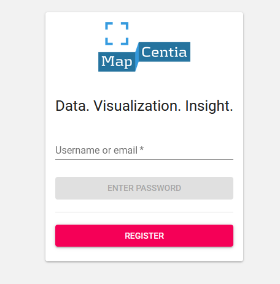
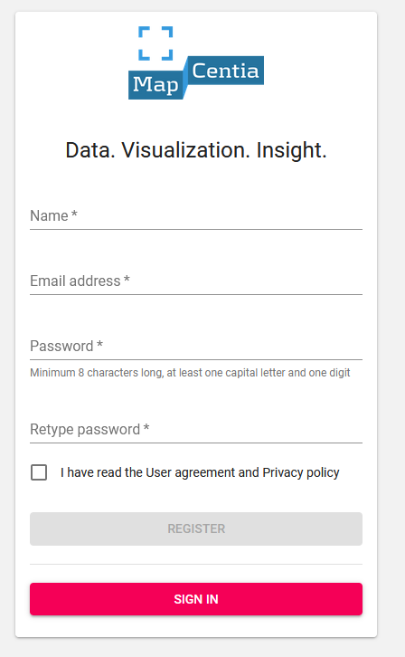
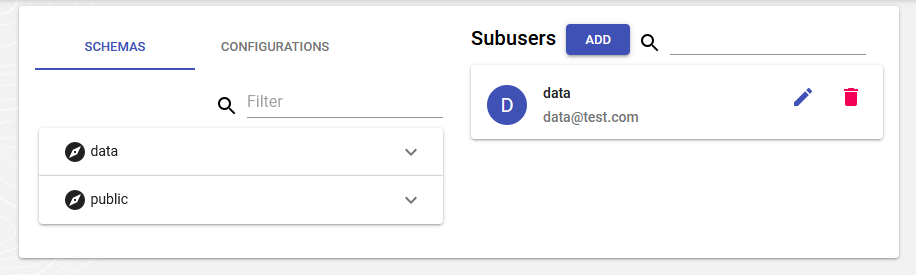
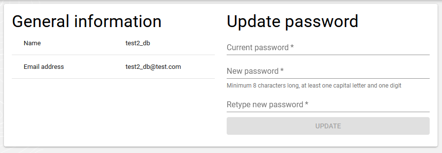
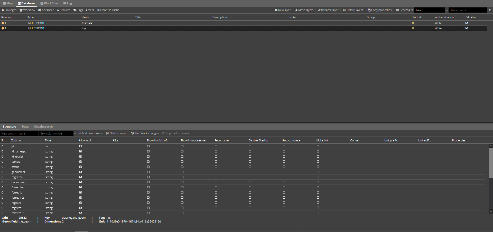
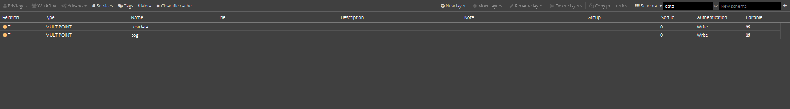
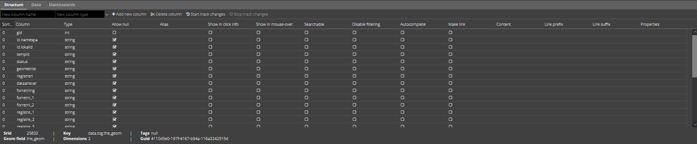

.. _gettingstarted:

============================================================
Documentation for GC2
============================================================

Here you can find documentation for GeoCloud2

In this document you can learn hoow GC2 is used, and how the different parts work.

API documentation for GC2 is made in swagger. This means that the documentation is on the site you work on. To find the dokumentation you will have to navigate to an url at your site. The url is made like this <GC2 site url>/swagger-ui/

It is important that you use the API-documentation on your actual site. It will always apply to the version of GC2 that you develop on. `Here you can see an example of the dokumentation. <https://dk.gc2.io/swagger-ui/>`_

*****************************************************************
Get started using GC2
*****************************************************************

.. topic:: Overview

    :Date: |today|
    :GC2-version: 2020.12.0
    :Forfatter: `GEOsmeden <https://github.com/geosmeden>`_,

.. contents:: 
    :depth: 3

What is GC2?
================================================================= 

GeoCloud2, hereafter GC2 will be used, is an enterprise platform for handling geospatial data, map-visualisation and spatiale tools. The platform is built on the best opensource and standard based programs.

GC2 makes it easy to start using PostGIS, MapServer, QGIS Server, MapCache, Elasticsearch, GDAL/OGR2OGR. User interface to GC2, is a simple web-interface for administration of the software stack.

The aim for GC2 is to make it easy for organisations to use opensource tools to build a geospatial infrastructure.

To read more go to :ref:`readme`

Get started
=================================================================

The url of your site is chosen when GC2 is installed. Navigate to the site url to get started.

.. _gettingstarted_login:

Login
-----------------------------------------------------------------

Start by signing into GC2 at the front page. You can login as the Database user or a sub user.

The first thing you see is the Dashboard, where a list of database schemas are displayed. Schemas represent a logical division of the database. Schema 'public' is a standard schema that always exist in the database, and should normally not be used.

enther the username and press ``Enter password``. It will then be checked if the user exist. If it does it will be possible to enter the password. after that press ``Sign in``.

If login succeeds it will automatically open the dashboard :ref:`dashboard`

    Log in

.. _gettingstarted_register:

Register/create databaseuser/new database
-----------------------------------------------------------------

.. note::
  If you are looking for subusers, read more here: :ref:`subuser`

A databaseuser is the owner of the database where data resides. It is the user that normally is used for administration of the site.

To create a database-user you press the ``Register``. Fill in the registration form to create a database user and the new database.

When done use the information to to log in.

    Create database user

.. _gettingstarted_dashboard:

Dashboard
=================================================================

When you are logged in to GC2, then you see the dashboard. 

The Dashboard is the place where in the left side there is a list of the schemes og configurations in the database. In the right side is a list of subusers. You can also create subusers here.

In the blue topbar is at questionmark, this gives acces to this documentation, and beside is the usenmae of the profile that is logged in. If you click the username it will open a userprofile. Read more ablout userprofile here: :ref:`gettingstarted_userprofile`

    Dashboard

Schemes
-----------------------------------------------------------------

Each scheme in the database will be shown. there is a filter option to filter the list.

The scheme ``public`` is always created when the dabase is created, and should not normally be used.

If you click on a scheme it is unfolded and it is possible to either:

* Open Vidi with the layers in the current scheme.
* Go to the administration page(the gear).

Configurations
-----------------------------------------------------------------

Configurations is json files that is stored in the database. Configurations are used to control the Vidi viewer. So this is where you control which layers and background layers is displayed, and which extensions are available. 

The configurations are create here and must have a name, it can be supplied with a description too.

For more information about the possibilities in the configurations, read the section in the Vidi dokumentation (currently only in danish) `Vidi kørselskonfiguration <https://vidi.readthedocs.io/da/latest/pages/standard/91_run_configuration.html>`_

.. _gettingstarted_userprofile:

User profile
-----------------------------------------------------------------

When you are logged in to GC2, You can view the userprofile in the blue topbar. Click on the username, and a dialog will open, where it is possible to view user information and change password.

    User profile

Subusers
-----------------------------------------------------------------

This is a list of all subusers. Read more about subusers here :ref:`subuser`

.. _gettingstarted_admin:

Administration module
=================================================================

Administration module is divided in tabs. The tabs are explained below.

.. _gettingstarted_admin_map:

Map
-----------------------------------------------------------------

In the tab "Map" on the left side you can see an overview of the layers in the scheme. If the layers are not set up yet, they are found under ungrouped. Otherwise, they are found in the grouping made in the database tab, which is described later. Above the layer list, it is possible to add new layers and reload the page if something has been made that does not display correctly.

To the right of the layer overview is the styling window. Here, a setup of the cartography on the layer can be made for each layer. There is a class wizard which can be used to make a quick setup, which can then be adjusted afterwards.

In the rest of the tab, a map is displayed where the set data can be seen when the layer is switched on in the layer tree.

.. _gettingstarted_admin_database:

.. figure:: ../../../_media/en/gettingstarted-admin-map.png
    :width: 690px
    :align: center
    :name: gettingstarted-admin-map
    :figclass: align-center

    Map

Database
-----------------------------------------------------------------

In the Database tab, the database can be managed. This is where the overall layer properties are set and the table structure can be changed.

    Database

Layer list
~~~~~~~~~~~~~~~~~~~~~~~~~~~~~~~~~~~~~~~~~~~~~~~~~~~~~~~~~~~~~~~~~~

The upper part of the tab contains a line with different functions. Below the line is the layer list.

    Layer list

Layer properties can be changed by double-clicking on the field in the list that you want to change.

1. Type: The geometry type of the layer which can be (MULTI)POINT, (MULTI)LINESTRING, (MULTI)POLYGON or GEOMETRY. The latter means that the layer can have a mixture of several different types. The layer type cannot be changed.
#. Name: The technical name of the layer. If the layer is imported from a file, the name of the layer corresponds to the file name. The technical name of the layer cannot be changed.
#. Title: The title of the team. If title is set, it is the one that appears in the layer tree, signatures, WMS/WFS titles, etc.
#. Description: A descriptive text for the layer. Used in WMS/WFS abstract.
#. Group: Groups are used to divide the layer tree in the Map tab and in the Viewer. This is a combo field: Either write the name of a new group or select an existing one.
#. Black id: Position of the layer in layer hierarchy. That is whether a layer lies above or below another layer when they are displayed together in the Map tab or the Viewer.
#. Authentication: What level of authentication is desired for the individual layer in WMS and WFS services? Write = authentication only when editing, Read/Write = authentication when both reading and editing, None = no authentication on the layer.
#. Writable: If turned off, the layer cannot be edited in the Map tab or through WFS-T.
#. Tile cache: Manual deletion of the layer's tile cache. This is usually not necessary to do as GC2 checks for deletion when needed.

Tabelstructure
~~~~~~~~~~~~~~~~~~~~~~~~~~~~~~~~~~~~~~~~~~~~~~~~~~~~~~~~~~~~~~~~~~

When a layer in the layer list is selected, the layer's table structure is displayed in the section below. Properties can be set on the columns here. Properties can be changed by double-clicking on the field in the list that you want to change. Columns can be added and deleted.

    Tabelstructure

1. Sort id: In which order the columns can be displayed in queries in the Viewer. Columns with lower sort id are displayed at the top.
#. Column: Name of the column. The name can be changed, but consider using Alias ​​(4) instead.
#. Type: The type of the column. Can not be changed.
#. ALLOW NULL:
#. Alias: An alias for the column. Shown for queries in the Viewer.
#. Show in click-info: Should the column be displayed for queries in the Viewer? The starting point is that all columns are displayed. If these properties are changed, only those that are checked will be displayed.
#. SHOW IN MOUSE OVER:
#. SEARCHABLE:
#. ENABLE FILTERING:
#. Make a link: If the content in the column is a link, it can be made active in the Viewer by queries.
#. IMAGES:
#. Link prefix: If links e.g. are missing "http://" this can be added here.
#. PROPERTIES:
#. Properties: Can contain arbitrary information for use in custom applications.
#. Add New Column: Add a new column to the layer's table.
#. Delete Column: Delete the selected column.

Move layers between schemes
~~~~~~~~~~~~~~~~~~~~~~~~~~~~~~~~~~~~~~~~~~~~~~~~~~~~~~~~~~~~~~~~~~

.. figure:: ../../../_media/gettingstarted-admin-database-movelayer-schema.png
    :width: 690px
    :align: center
    :name: gettingstarted-database-layerlist
    :figclass: align-center

    Move layers between schemes

1. Select one or more layers in the layer list (hold Shift or Ctrl to select more) and click "Move Layer".
#. Choose which scheme they should be moved to.

Rename layer
~~~~~~~~~~~~~~~~~~~~~~~~~~~~~~~~~~~~~~~~~~~~~~~~~~~~~~~~~~~~~~~~~~

.. figure:: ../../../_media/gettingstarted-admin-database-rename-layer.png
    :width: 690px
    :align: center
    :name: gettingstarted-database-layerlist
    :figclass: align-center

   Rename layer

1. Select a single layer and click "Rename layer".
#. Choose a new name for the layer.

Create table from scratch
~~~~~~~~~~~~~~~~~~~~~~~~~~~~~~~~~~~~~~~~~~~~~~~~~~~~~~~~~~~~~~~~~~

You can create a new empty table from scratch by first clicking on new layer

.. figure:: ../../../_media/gettingstarted-admin-database-create-table.png
    :width: 690px
    :align: center
    :name: gettingstarted-database-layerlist
    :figclass: align-center

    Klik nyt lag
	
	
.. figure:: ../../../_media/gettingstarted-admin-database-create-table-dialog.png
    :width: 690px
    :align: center
    :name: gettingstarted-database-layerlist
    :figclass: align-center

    New Layer dialog box

1. Click on Blank layer.
#. give the new table a name.
#. Set EPSG code for the geometry field.
#. Set type code for the geometry field.

If you want a table without geometry, the geometry field is just deleted after the table is created.

.. _gettingstarted_admin_versioning:

Versioning of data (Track changes)
-------------------------------------------------- ---------------

When versioning data, all changes are retained in the table. That is that the full transaction history is kept. Versioning enables users to go back in history and see what a layer looked like at a specific point in time. Versioning also acts as journaling of all transactions made at the layer.

A versioned layer works like any other layer and can be edited in the normal way. GC2 takes care of the versioning in the background.

Versioning takes place in the WFS layer. So it will work both when editing in GC2's Map tab, but also through external WFS editors such as e.g. QGIS.

.. include:: ../../_subs/WARNING_OLD_DOC.rst

**Start "Tracking changes" on a layer**

.. figure:: ../../../_media/versioning-start-tracking-changes.png
    :width: 600px
    :align: center
    :name: versioning-start-tracking-changes
    :figclass: align-center

    start versioning

1. Select layer by clicking on the line so that it turns gray.
#. Click "Start versioning".

**New system fields in the table**

.. figure:: ../../../_media/versioning-system-fields.png
    :width: 600px
    :align: center
    :name: versioning-system-fields
    :figclass: align-center

    New fields

The layer's table gets five new system fields (system fields always start with "gc2_"). Fields contain version data for each feature in the table. The system fields are:

**gc2_versions_gid** Is a key that relates different versions of a feature. That is are two versions of this same feature, have the same key value.

**gc2_version_start_date** Is a timestamp indicating when the version was created. All features have a value in this field.

**gc2_version_end_date** Is a timestamp indicating when the version ended. Only completed versions have a value in this field and the current version does not have a value in this field.

**gc2_version_uuid** Is a "universally unique identifier" that all versions are assigned. This value is globally unique.

**gc2_version_user** Is the (sub-)user who created the version.

**Version data in the table**

.. figure:: ../../../_media/versioning-versiondata.png
    :width: 600px
    :align: center
    :name: versioning-versiondata
    :figclass: align-center

    version data

This is an example of version data in the table. This versioned table has three new items, each of which has the date/time of creation (gc2_version_start_date), a unique ID (gc2_version_uuid), and which user created the items (gc2_version_user).

**See all versions**

.. figure:: ../../../_media/versioning-see-all-versions.png
    :width: 600px
    :align: center
    :name: versioning-see-all-versions
    :figclass: align-center

    version data

By default, only current features are displayed, i.e. those without a gc2_version_end_date. It is possible to see all features at once.

1. Start editing the layer.
#. Select "all" under "Time slicing", which must be checked in the box.
#. Load features.

.. figure:: ../../../_media/versioning-example.png
    :width: 600px
    :align: center
    :name: versioning-example
    :figclass: align-center

    Example of versions

The example shows two actual points. Furthermore, it can be seen that the point with **gc2_version_gid** = 2 exists in two versions: One current and one completed. That is that the item has been edited. The item with **gc2_version_gid** = 1 is closed and there are no other versions of this item. That is that the point has been deleted.

Finished versions show with a red dotted border. These cannot be edited.

**Time slicing**
	
.. figure:: ../../../_media/versioning-timeslicing.png
    :width: 600px
    :align: center
    :name: versioning-timeslicing
    :figclass: align-center

    Timeslicing
	
It is possible to see how a layer looked at a certain time.

1. Start editing the layer.
#. Check "Time slicing" and enter a date/time in the format yyyy-mm-dd hh:mm:ss e.g. 2015-06-30 14:34:00. If the time is omitted, it will be set to 00:00:00.
#. Load features.
	
	
.. figure:: ../../../_media/versioning-timeslicing-example.png
    :width: 600px
    :align: center
    :name: versioning-timeslicing-example
    :figclass: align-center

    Timeslicing example

With Time slicing, the versions that were current on the relevant date/time are displayed. That is that only one version is displayed per feature (**gc2_version_gid** values ​​are unique). The example shows that there were three current points, one of which is still current (the blue one) and two which have later either been changed or deleted (red). For the changed items, **gc2_version_end_date** shows the time of the change.

**Versioning in external editor e.g. QGIS**
	
	
.. figure:: ../../../_media/versioning-example-qgis.png
    :width: 600px
    :align: center
    :name: versioning-example-qgis
    :figclass: align-center

    versioning in QGIS

Versioning takes place in the WFS layer. That is that it works both when editing in GC2's Map tab, but also through external WFS editors such as e.g. QGIS.

When using the default WFS connection string, only the current versions are displayed. That is that this is no different than for non-versioned layers:

http://example.com/wfs/mydb/public/4326

If all versions are to be displayed in QGIS, use this string:

http://example.com/wfs/mydb/public/4326/all

And with Time slicing this is used: (Note the "T" between date and time)

http://example.com/wfs/mydb/public/4326/2015-06-30T14:34:00

.. _gettingstarted_admin_workflow:

Workflow management
-----------------------------------------------------------------

Workflow allows to control the editing of a layer in a typical author-editor-publisher chain.

A layer under workflow control works like any other layer and can be edited in the normal way. GC2 takes care of the workflow in the background.

Workflow takes place in the WFS layer. That is that it works both when editing in GC2's Map tab, but also through external WFS editors such as e.g. QGIS.

**Start "track changes" on the layer.**

.. figure:: ../../../_media/workflow-start-tracking-changes.png
    :width: 600px
    :align: center
    :name: workflow-start-tracking-changes
    :figclass: align-center

    start versioning

Workflow builds on top of the versioning system in GC2, so it is necessary to start "Track changes" on the layer.

1. Select a layer by clicking on the line so that it turns gray.
#. Click on "Track changes". Read more about "Track changes"
#. IMPORTANT! Remember to set the Authentication level to "Read/write" on the layer.

**Give Privileges to Sub-Users**
	
.. figure:: ../../../_media/workflow-add-privileges.png
    :width: 600px
    :align: center
    :name: workflow-add-privileges
    :figclass: align-center

    Workflow

The sub-users who must have a role in the workflow must have been assigned privileges to the layer. Read more about sub-users and privileges.

1. Select a layer by clicking on the line so that it turns gray.
#. Click on "Privileges".
#. Set the privilege to "Read and Write" (or "Everyone") for each sub-user that should have a role in the workflow.

**Start Workflow on the layer**
	
.. figure:: ../../../_media/workflow-start-workflow.png
    :width: 600px
    :align: center
    :name: workflow-start-workflow
    :figclass: align-center

    Start Workflow

1. Start workflow on the layer by clicking "Workflow".
#. The Workflow dialog appears.
#. The layer's table gets two new system fields (system fields always start with "gc2_"). The fields contain workflow data for each feature in the table. The fields are:

``gc2_status'' Contains the feature's status, which is either: 1 = Draft, 2 = Reviewed or 3 = Published.

``gc2_workflow'' Contains the workflow chain.

**Assign roles in the Workflow**
	
.. figure:: ../../../_media/workflow-add-roles.png
    :width: 600px
    :align: center
    :name: workflow-add-roles
    :figclass: align-center

    Workflow roles

A sub-user can have one of the following roles in a workflow:

**Author** Can create new features. Can also change a feature that is NOT Reviewed or Published. That is which has not progressed in the workflow.

**Reviewer** Can change or approve a feature. Cannot change a feature that is Published.

**Publisher** Can modify or approve a feature for final release.

Sub-users who do not have a role in the workflow cannot make changes to the layer.

A role can be held by two or more users. For example, a layer can have two Authors.

Note that it is not necessary for all roles to be occupied. For example, if you want to skip the Reviewer led, this can be done.

**Workflow tab**
	
.. figure:: ../../../_media/workflow-workflow-tab.png
    :width: 600px
    :align: center
    :name: workflow-workflow-tab
    :figclass: align-center

    The Workflow tab

When a layer is under workflow control, all transactions on the layer can be seen in the "Workflow" tab. Each line is a transaction. The list only shows transactions that are relevant to the user, i.e. those that the user must take action on.

The example shows a transaction on an item made by Lilly, who is the Author.

Each transaction has the following values:

**Operation** Is which operation was performed on the layer: insert, update or delete.

**Table** Which table the transaction was performed on.

**Fid** The value of the primary key on the feature the transaction was executed on.

**Version id** The version id value of the feature the transaction was performed on.

**Status** The status the feature has after the transaction.

**Latest edit by** The sub-user who performed the transaction.

**Authored by** The Author who created the feature.

**Reviewed by** The Reviewer who has approved the feature.

**Published by** The Publisher who has approved the feature.

**Created** The transaction timestamp.

Buttons in Workflow

1. **Show all**. Shows all transactions. Also the one that is not current for the user.
#. **See/edit feature**. Switches to the Map tab and loads the feature.
#. **Check feature**. Accept the feature. Corresponds to an update of the feature without changing it.

**After "Review"**
	
.. figure:: ../../../_media/workflow-after-review.png
    :width: 600px
    :align: center
    :name: workflow-after-review
    :figclass: align-center

   Workflow status

The example shows an item that has been reviewed (approved by Reviewer Carl). The point now has status 2.

**After "Publish"**
	
.. figure:: ../../../_media/workflow-after-publish.png
    :width: 600px
    :align: center
    :name: workflow-after-publish
    :figclass: align-center

   Workflow status published

The example shows an item that is published (approved by Publisher Julie). The item now has status 3.

**Skip in the Workflow chain**
	
.. figure:: ../../../_media/workflow-skip-step.png
    :width: 600px
    :align: center
    :name: workflow-skip-step
    :figclass: align-center

    Workflow skip

It is possible for a user to skip a lower link in the workflow chain. The example shows that reviewer Carl has been skipped by publisher Julie.

**Workflow information in data**
	
.. figure:: ../../../_media/workflow-display-data.png
    :width: 600px
    :align: center
    :name: workflow-display-data
    :figclass: align-center

    Workflow display in data

The workflow information for the individual features is stored in the layer's table in the fields **gc2_status** and **gc2_workflow**.

**gc2_status** Indicates status 1-3.

**gc2_workflow** Contains the workflow chain. The chain is a list in the form, for example: "author"=>"lilly", "reviewer"=>"carl" This chain shows that the item was created by Lilly, reviewed by Carl, but still not approved by a publisher.

**Use of external editor in Workflow**
	
.. figure:: ../../../_media/workflow-in-qgis.png
    :width: 600px
    :align: center
    :name: workflow-in-qgis
    :figclass: align-center

    Workflow in QGIS

Workflow takes place in the WFS layer. That is that it works both when editing in GC2's Map tab, but also through external WFS editors such as e.g. QGIS.

The layer is imported and edited in the usual way in QGIS.
	
	
	
	
	
	
	
	
	

.. _gettingstarted_admin_log:

Log
-----------------------------------------------------------------

TBD

.. figure:: ../../../_media/gettingstarted-admin-log.png
    :width: 400px
    :align: center
    :name: gettingstarted-admin-log
    :figclass: align-center

    Log